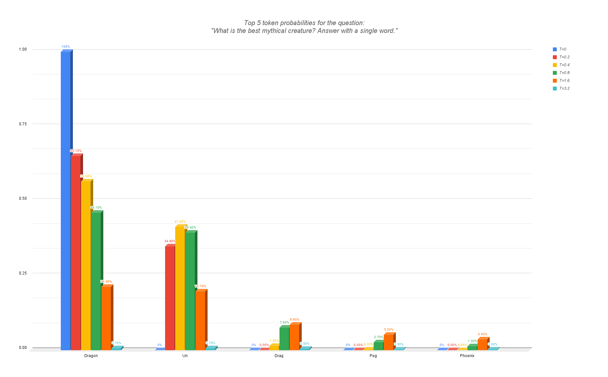

# Temperature

**Temperature**, often highly correlated with randomness, is a fundamental parameter in Language Learning Models (LLMs) and is widely used as the most popular sampler setting. This concept plays a crucial role in exploring diversity to achieve a diverse range of outputs from the same input. Lower Temperature values are associated with deterministic behaviors, making the model predict the more likely responses, focusing on accuracy. In contrast, higher Temperature values are associated with creativity, making the model output more diverse and creative responses.

When an LLM is trained with large amounts of data, it learns patterns from that corpus of text to predict and build a set of possible tokens when completing text. To be more specific, when an LLM is asked a question, it starts by outputting a set of tokens, not just a single one. It responds with a set of tokens, each with an associated probability. That probability is computed through a softmax function that takes what we call logits, which are associated with each token depending on how likely they are, and transforms them into probabilities that sum to 1. What the Temperature does in this softmax function is impact how the softmax function scales these logits. The higher the Temperature, the more the differences between the logits are softened, making the distribution of probabilities flatter. In contrast, lower Temperatures prioritize and impact higher logits more significantly while reducing those of lower logits, amplifying the difference between logits.

## Softmax Formula
The softmax function for a given candidate token `i` with logits `yi` is defined as:

$$
\text{softmax}(y_i) = \frac{e^{y_i / T}}{\sum_{k=1}^{n} e^{y_k / T}}
$$

Where:
- `e` is Euler's number.
- `T` is the Temperature parameter.
- `n` is the size of the vocabulary.
- `yi` is the logit for the `i`-th candidate token.
- `yk` are the logits for all candidate tokens `k` in the vocabulary.

This formula normalizes the logits into a probability distribution over the vocabulary, where the Temperature parameter `T` controls the sharpness of the distribution.  
The original probability distribution is the equivalent of a Temperature of 1.

> Note: When using a null value for the Temperature, usually greedy sampling is chosen instead, and the token with the highest probability is always picked.

## Visualisation

To better understand the underlying principle and impact it has on the probability distribution, here is a visualisation of the Temperature with a simple prompt:
    *"What is the best mythical creature? Answer with a single word."*

  

  Barplot comparing the distribution with different `Temperature` values and the top 5 tokens using Mistral 7B at 4 bits precision.

As seen, the Temperature has a considerable impact on the probability distribution. While with a Temperature of null the answer will always be "**Dragon**", by increasing the Temperature we can make it possible to answer with different tokens. In this case, simply increasing to 0.2 makes it possible to get "Un" as the next token, possibly to predict a creature such as an "**Un**icorn"! While the 3rd token seems to be "Drag" to again answer "**Drag**on", the 4th is the start of "**Peg**asus" while the 5th is "**Phoenix**"! By changing the Temperature values, we can make tokens originally less statistically likely to be chosen more likely, giving them more chances and making the output of the LLM more diverse!

You can experiment yourself with sampler settings, Temperature included, on [artefact2](https://artefact2.github.io/llm-sampling/index.xhtml), a nice playground to visualise and understand LLM samplers and their settings.

## The Best Temperature
There is no "**one-size-fits-all**" Temperature that would work for all use cases, however, there are some hints that can help you decide and experiment to find the best for your applications.

### Determinism
Wonder if your application requires a model to be **deterministic**. Is your task specific enough to always require the same response for the same input? Is it crucial to always have the best and **most accurate response** at all times? Such applications might involve Mathematics, Classification tasks, Healthcare, or Reasoning. Fields that would **require a high level of accuracy** and a deterministic model is a must! For those cases, very **low Temperature** values are the way to go. Sometimes not null to add a bit of uniqueness to each generation if you need it.

Let's say you want to make a classification agent to classify accurately articles. It makes the most sense to have a null Temperature and always pick the best token.

However, if your task is to have a chat assistant on mathematics, for example, you would indeed require a deterministic model for very high accurate responses, but you would also want it to not be too repetitive every time you ask similar questions or you want to be able to regenerate the response a bit differently. For this, you would keep very low Temperature values but avoid a null value since you still want a little bit of randomness.

### Creativity
Do you need **diverse** outputs? A creative model to generate different and unique text? Usually, these requirements are linked to tasks such as brainstorming ideas, assisting writing novels, coming up with original slogans, or roleplaying. Usually, it's about use cases where **accuracy is considerably less important** and what you require is something more **creative**. For these, it makes sense to have **high Temperature** values, but the question for these is what should be the high limit?

Usually, you do not want to overdo it and put too high Temperatures, as what happens is that the model can become too random. It will struggle to follow instructions, saying nonsense and not helping you in the slightest! It's important to always take these trade-offs into consideration, that by increasing the uniqueness of the output to get more originality and creativeness, it can also damage the quality and accuracy, often not a priority for these use cases.

## What Have We Learnt?

1. **Role of Temperature**: Temperature is a critical parameter that influences the diversity and creativity of the outputs generated by LLMs. Lower Temperatures lead to more deterministic and accurate responses, while higher Temperatures introduce more randomness and creativity.

2. **Softmax Function**: The Temperature parameter directly affects the softmax function, which normalizes logits into a probability distribution. Higher Temperatures flatten the distribution, making less likely tokens more probable, while lower Temperatures sharpen the distribution, favoring the most likely tokens.

3. **Impact on Outputs**: By adjusting the Temperature, we can control the model's behavior to suit different applications. For tasks requiring high accuracy and determinism, such as mathematics or classification, lower Temperatures are preferred. Conversely, for creative tasks like brainstorming or writing novels, higher Temperatures are more suitable.

4. **Trade-offs**: Increasing the Temperature to enhance creativity can also introduce more inaccuracy, potentially leading to less coherent or relevant outputs. Balancing creativity and coherence is crucial for effective use of LLMs.

5. **Experimentation**: There is no one-size-fits-all Temperature value. Experimentation is extremely important to find the optimal Temperature for specific applications. Tools like [artefact2](https://artefact2.github.io/llm-sampling/index.xhtml) can be useful for visualizing and understanding the effects of different Temperature settings.

Visit other sampler settings here -> <a href="README.md">Sampling</a>
