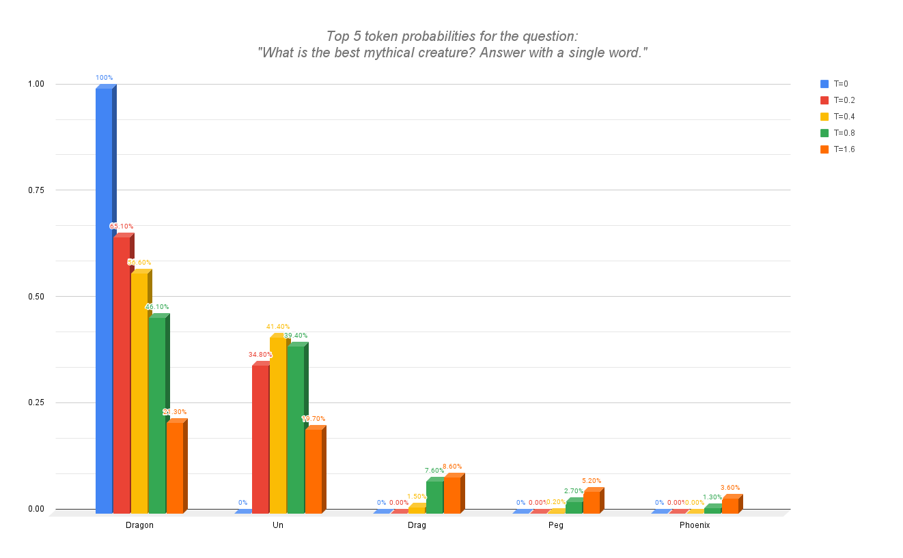
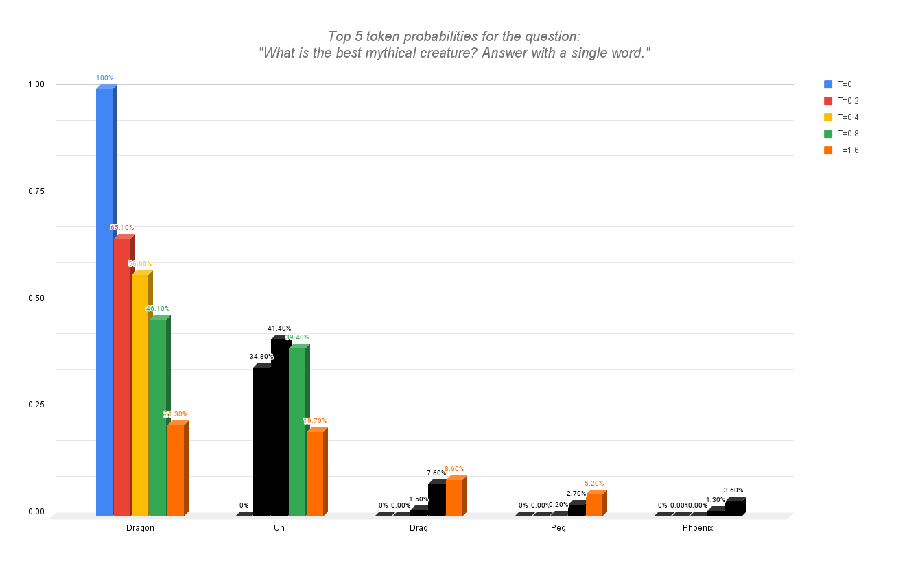
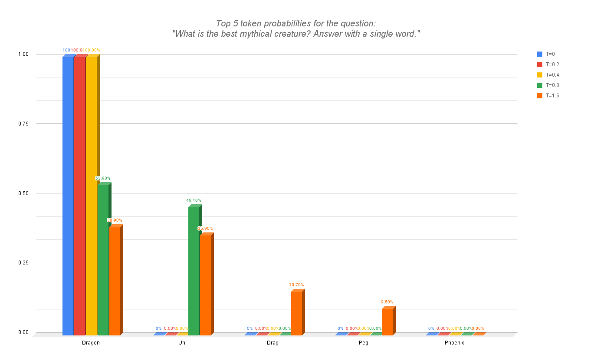

# Top P

**Top P** is a sampler setting that enables delimiting how many tokens will be considered based on a percentage. The idea behind it is to not consider the entirety of the vocabulary when sampling but only a certain amount among a certain probability mass.

Let's say we set a Top P of 0.1, this would translate to only considering the best tokens whose sum of probabilities adds up to 10%.

## Visualization
For the following demonstrations, we will be setting the Temperature first and then a Top P of 50%. Note that a Temperature of 0 will always be deterministic, and in this scenario, Top P won't change anything.
The order of events is as follows:
- First, the Temperature is applied.
- After that, the Top P of 0.5 keeps only the most likely tokens.
- Their probabilities change due to certain tokens no longer being an option.

The distribution would change as follows:

  

    

Different Temperature values and the top 5 tokens using Mistral 7B at 4 bits precision.
  

  

    &darr;
  

  

    

Top P will only consider the topmost tokens until hitting the 50% target.
  

  

    &darr;
  

  

    

The other tokens probabilities are now 0, and the probabilities for the other tokens are adjusted.
  

Top P removes the possibility of the less likely tokens being chosen entirely, based on the mass probability, always only keeping the high end of the spectrum to consider only the very high-quality tokens. It allows for keeping a certain diversity of choices while completely removing the possibility of having very bad tokens being chosen, as they won't be considered. It's usually extremely tricky to balance both the Temperature and Top P, hence we usually recommend setting one of them fixed and only changing one or the other. However, you are free to experiment and find the optimal settings for your use cases!

# What Have We Learnt?

1. **Role of Top P**: Top P is a sampler setting that limits the number of tokens considered based on a specified probability mass. It helps in focusing on the most likely tokens, thereby improving the quality of the outputs generated by LLMs. When setting a Top P value, only the tokens whose cumulative probabilities add up to the specified percentage are considered. For example, a Top P of 0.1 means only the tokens whose probabilities sum up to 10% are taken into account.

2. **Interaction with Temperature**: Top P is usually applied after the Temperature setting. However samplers can often be highly customised.

3. **Impact on Outputs**: By using Top P, the model can avoid considering very unlikely tokens, which can help in maintaining a certain level of quality and coherence in the outputs.

4. **Balancing Temperature and Top P**: It is often challenging to balance both the Temperature and Top P settings. It is recommended to fix one parameter and adjust the other to find the optimal settings for specific use cases but experimentation is key to finding the best combination.

Visit other sampler settings here -> <a href="README.md">Sampling</a>
