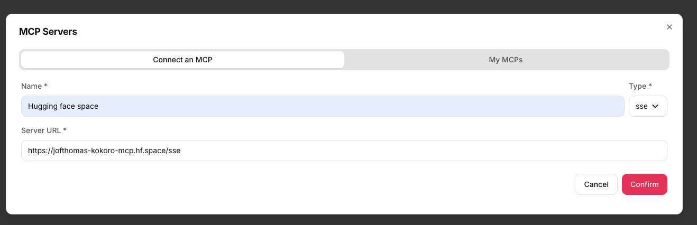

# Github Automation with Mistral AI Agents

This cookbook show how to create an Agent that use mistral Medium to perform some actions on your github.
> WIP: This cookbook is minimal working example and will still evolve in the near future.

[](https://www.youtube.com/watch?v=1Tt9Fq1pUPQ)


## Use Case

- Create a New Repo.
- Manage PRs.
- Collaborate with the AI to create some code and upload some code to an existing repo.

## Installation

```bash
pip install chainlit mcp mistralai
```

## Environment Setup
In this example, we are relying on the docker mcp :
```python
server_params = StdioServerParameters(
    command="docker",
    args=[
        "run",
        "-i",
        "--rm",
        "-e",
        "GITHUB_PERSONAL_ACCESS_TOKEN",
        "ghcr.io/github/github-mcp-server"
        ],
    env={
"GITHUB_PERSONAL_ACCESS_TOKEN": os.environ["GITHUB_PERSONAL_ACCESS_TOKEN"]
}
```
hence you will to make sure that :
1) you have docker on your computer.
2) you pull the associated images:
```bash
docker pull ghcr.io/github/github-mcp-server
```
3)You have created a token for github. You can do so [HERE](https://github.com/settings/tokens)

> **Disclaimer:** The coding is done by AI, hence when creating your GitHub token, for enhanced security, it is strongly recommended to create a [fine-grained personal access token](https://docs.github.com/en/authentication/keeping-your-account-and-data-secure/managing-your-personal-access-tokens#creating-a-fine-grained-personal-access-token) with only the minimum necessary permissions for the tasks you intend to perform. 

Set your MistralAI API key and your Github key:
```bash
export MISTRAL_API_KEY="your_api_key_here"
export GITHUB_PERSONAL_ACCESS_TOKEN="your_api_key_here"
```
## Usage

Run the application:
```bash
chainlit run github.py
```

Ask questions like:
- "Create a repo under my username : <USERNAME> called ..."
- "Generate the files for a todo app and push them to repo ... under branch name ..."

## MCP Usage

There is two type of MCPs.

STDIO : Local usage of tools.
SSE : Remote usage of tools.

In this example, we leverage the chainlit integration of MCP tools, and directly convert them in our API ! Hence do not hesitate to test other MCP Servers yourself.


