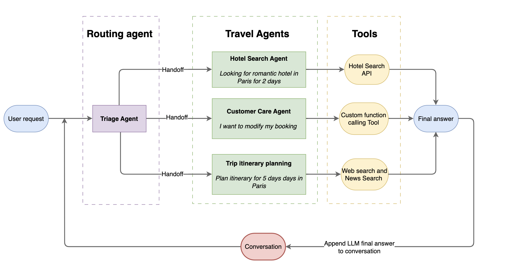

# Travel Assistant 

A powerful AI-powered travel assistant built with Mistral's agent SDK that helps users plan their trips, book accommodations, and manage their travel needs.

[](https://www.youtube.com/watch?v=DSYlhtG2UNM)

## Architecture



## Features

- 🏨 **Hotel Booking**: Search and book hotels based on preferences
- 📅 **Trip Planning**: Get personalized itineraries and recommendations
- 🎫 **Customer Support**: Handle bookings, cancellations, and inquiries

## Example Queries

```bash
# Hotel Booking
"I want to book a hotel in Paris for 2 nights from 10th May 2025 to 12th May 2025 for 2 adults"
"Find me a 4-star hotel in Tokyo near Shibuya station"

# Trip Planning
"I am going to Paris, what are the must visit places"
"Create a 3-day itinerary for Rome"

# Customer Care with booking modification
"I want to modify my booking"
"I want to cancel my booking"
```

## Prerequisites

- Python 3.10 or higher
- Uv package manager ([uv install](https://docs.astral.sh/uv/getting-started/installation/))
- API Keys:
  - [Mistral AI API key](https://mistral.ai/api-key)
  - [SerpAPI key](https://serpapi.com/dashboard) (Free plan available)


## Installation


1. Install dependencies:
```bash
cd mistral/agents/travel-assistant
uv sync
source .venv/bin/activate
```

3. Configure environment variables:
```bash
# Create a .env file
cp .env.example .env

# Add your API keys to .env
export MISTRAL_API_KEY=<your-mistral-api-key>
export SERP_API_KEY=<your-serp-api-key>
```

4. Run the application:
```bash
chainlit run agent.py -w
```

## Usage

1. Open your browser and navigate to `http://localhost:8000`
2. Start chatting with the assistant using natural language
3. Follow the assistant's prompts to complete your travel-related tasks


