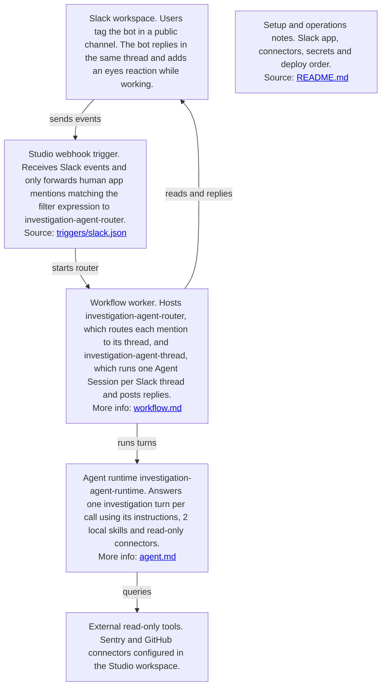

```mermaid
graph TD
    Slack["Slack workspace. Users tag the bot in a public channel. The bot replies in the same thread and adds an eyes reaction while working."]
    Trigger["Studio webhook trigger. Receives Slack events and only forwards human app mentions matching the filter expression to investigation-agent-router.<br/>Source: <a href='../triggers/slack.json'>triggers/slack.json</a>"]
    Workflow["Workflow worker. Hosts investigation-agent-router, which routes each mention to its thread, and investigation-agent-thread, which runs one Agent Session per Slack thread and posts replies.<br/>More info: <a href='workflow.md'>workflow.md</a>"]
    Agent["Agent runtime investigation-agent-runtime. Answers one investigation turn per call using its instructions, 2 local skills and read-only connectors.<br/>More info: <a href='agent.md'>agent.md</a>"]
    Tools["External read-only tools. Sentry and GitHub connectors configured in the Studio workspace."]
    Docs["Setup and operations notes. Slack app, connectors, secrets and deploy order.<br/>Source: <a href='../README.md'>README.md</a>"]

    Slack -->|sends events| Trigger
    Trigger -->|starts router| Workflow
    Workflow -->|reads and replies| Slack
    Workflow -->|runs turns| Agent
    Agent -->|queries| Tools
```
