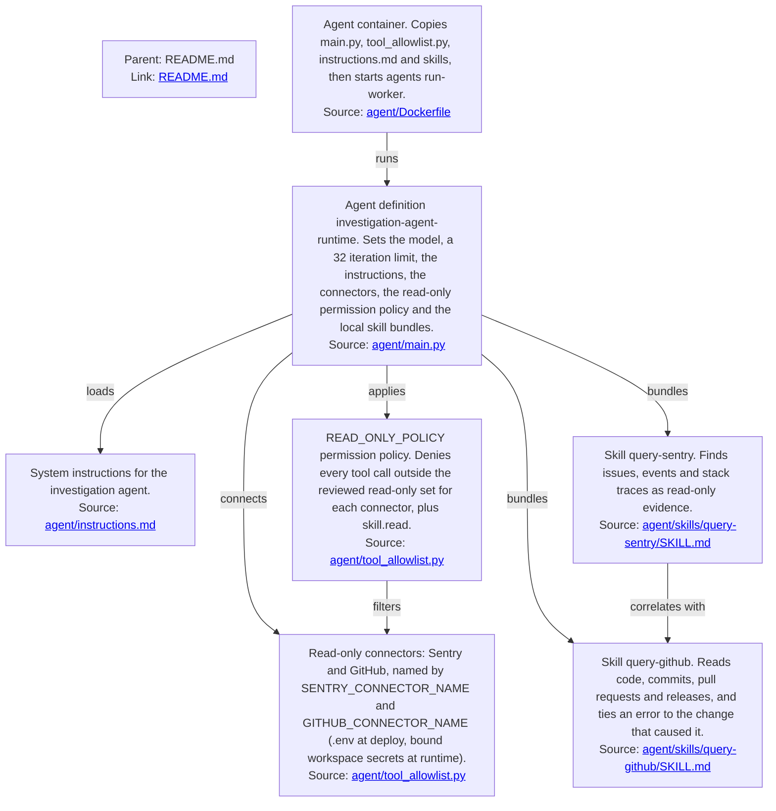

```mermaid
graph TD
    %% Parent Graph Link
    ParentGraph["Parent: README.md<br/>Link: <a href='README.md'>README.md</a>"]

    Main["Agent definition investigation-agent-runtime. Sets the model, a 32 iteration limit, the instructions, the connectors, the read-only permission policy and the local skill bundles.<br/>Source: <a href='../agent/main.py'>agent/main.py</a>"]
    Image["Agent container. Copies main.py, tool_allowlist.py, instructions.md and skills, then starts agents run-worker.<br/>Source: <a href='../agent/Dockerfile'>agent/Dockerfile</a>"]
    Instructions["System instructions for the investigation agent.<br/>Source: <a href='../agent/instructions.md'>agent/instructions.md</a>"]
    Connectors["Read-only connectors: Sentry and GitHub, named by SENTRY_CONNECTOR_NAME and GITHUB_CONNECTOR_NAME (.env at deploy, bound workspace secrets at runtime).<br/>Source: <a href='../agent/tool_allowlist.py'>agent/tool_allowlist.py</a>"]
    Policy["READ_ONLY_POLICY permission policy. Denies every tool call outside the reviewed read-only set for each connector, plus skill.read.<br/>Source: <a href='../agent/tool_allowlist.py'>agent/tool_allowlist.py</a>"]
    Sentry["Skill query-sentry. Finds issues, events and stack traces as read-only evidence.<br/>Source: <a href='../agent/skills/query-sentry/SKILL.md'>agent/skills/query-sentry/SKILL.md</a>"]
    GitHub["Skill query-github. Reads code, commits, pull requests and releases, and ties an error to the change that caused it.<br/>Source: <a href='../agent/skills/query-github/SKILL.md'>agent/skills/query-github/SKILL.md</a>"]

    Image -->|runs| Main
    Main -->|loads| Instructions
    Main -->|connects| Connectors
    Main -->|applies| Policy
    Policy -->|filters| Connectors
    Main -->|bundles| Sentry
    Main -->|bundles| GitHub
    Sentry -->|correlates with| GitHub
```
