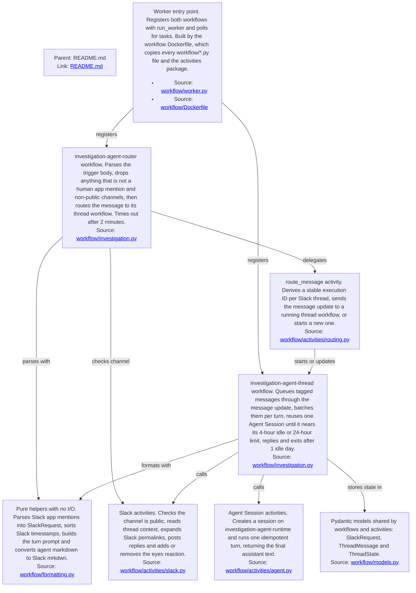

```mermaid
graph TD
    %% Parent Graph Link
    ParentGraph["Parent: README.md<br/>Link: <a href='README.md'>README.md</a>"]

    Worker["Worker entry point. Registers both workflows with run_worker and polls for tasks. Built by the workflow Dockerfile, which copies every workflow/*.py file and the activities package.<br/><ul><li>Source: <a href='../workflow/worker.py'>workflow/worker.py</a></li><li>Source: <a href='../workflow/Dockerfile'>workflow/Dockerfile</a></li></ul>"]
    Router["investigation-agent-router workflow. Parses the trigger body, drops anything that is not a human app mention and non-public channels, then routes the message to its thread workflow. Times out after 2 minutes.<br/>Source: <a href='../workflow/investigation.py'>workflow/investigation.py</a>"]
    Thread["investigation-agent-thread workflow. Queues tagged messages through the message update, batches them per turn, reuses one Agent Session until it nears its 4-hour idle or 24-hour limit, replies and exits after 1 idle day.<br/>Source: <a href='../workflow/investigation.py'>workflow/investigation.py</a>"]
    Models["Pydantic models shared by workflows and activities: SlackRequest, ThreadMessage and ThreadState.<br/>Source: <a href='../workflow/models.py'>workflow/models.py</a>"]
    Formatting["Pure helpers with no I/O. Parses Slack app mentions into SlackRequest, sorts Slack timestamps, builds the turn prompt and converts agent markdown to Slack mrkdwn.<br/>Source: <a href='../workflow/formatting.py'>workflow/formatting.py</a>"]
    Routing["route_message activity. Derives a stable execution ID per Slack thread, sends the message update to a running thread workflow, or starts a new one.<br/>Source: <a href='../workflow/activities/routing.py'>workflow/activities/routing.py</a>"]
    SlackActs["Slack activities. Checks the channel is public, reads thread context, expands Slack permalinks, posts replies and adds or removes the eyes reaction.<br/>Source: <a href='../workflow/activities/slack.py'>workflow/activities/slack.py</a>"]
    AgentActs["Agent Session activities. Creates a session on investigation-agent-runtime and runs one idempotent turn, returning the final assistant text.<br/>Source: <a href='../workflow/activities/agent.py'>workflow/activities/agent.py</a>"]

    Worker -->|registers| Router
    Worker -->|registers| Thread
    Router -->|parses with| Formatting
    Router -->|checks channel| SlackActs
    Router -->|delegates| Routing
    Routing -->|starts or updates| Thread
    Thread -->|calls| SlackActs
    Thread -->|calls| AgentActs
    Thread -->|formats with| Formatting
    Thread -->|stores state in| Models
```
