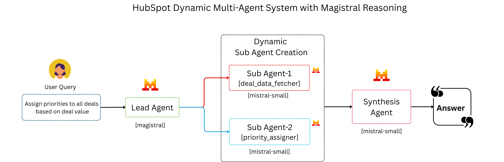

# HubSpot Dynamic Multi-Agent System

An intelligent multi-agent system that processes your queries into sophisticated CRM operations by dynamically creating specialized agents on-the-fly, demonstrating the power of Magistral reasoning combined with HubSpot integration to automatically understand complex business queries.



## 🎯 What It Does

Ask questions in plain English → Get analysis/ Report + automated CRM updates(Optional)

**Example:** *"Assign priorities to all deals based on deal value"*
- Analyzes all deals automatically
- Calculates priority scores  
- Updates HubSpot records in batches
- Provides executive summary

## Quick Demo:

*Watch the dynamic multi-agent system process a query in real-time*


## 🏗️ Architecture

- **Lead Agent**: Analyzes queries using Magistral reasoning
- **Sub-Agents**: Created dynamically for specific tasks  
- **Synthesis Agent**: Combines results into final answers
- **HubSpot Connector**: Handles CRM data and updates

## ⚡ Quick Start

### Requirements
```bash
# Install uv (if not already installed)
pip install uv
```

### Setup
1. Clone the repo:

```python
git clone https://github.com/mistralai/cookbook.git
cd cookbook/mistral/agents/non_framework/hubspot_dynamic_multi_agent
uv sync
```

2. Get API keys:
   - [HubSpot API Key](https://developers.hubspot.com/docs/guides/api/overview) 
   - [Mistral API Key](https://console.mistral.ai/api-keys)

3. Set environment variables:
```bash
export HUBSPOT_API_KEY="your_hubspot_key"
export MISTRAL_API_KEY="your_mistral_key"
```

4. Run the app:
```bash
uv run chainlit run app.py
```

## 💡 Example Query

```
Assign priorities to all deals based on deal value
```

### Models Used
- **Magistral Medium**: Complex reasoning and planning
- **Mistral Small**: Fast task execution and synthesis

⚠️ **Prerequisites**: Your HubSpot account must contain CRM data (deals, contacts, companies, etc.,) for the system to analyze and update.
