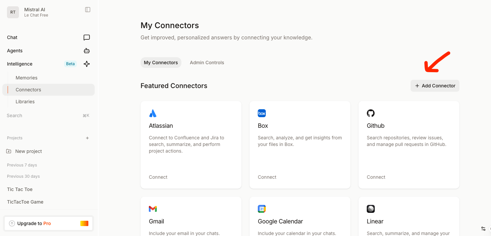
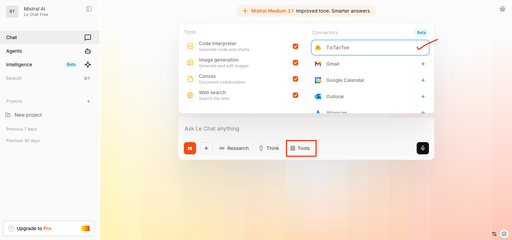

# Build a Custom MCP Server on LeChat: Tic-Tac-Toe with MistralAI

## What You'll Create

By the end of this tutorial, you'll have built a **fully functional MCP server** that allows you to play tic-tac-toe directly inside our chat interface - LeChat.

## Demo Video

[Watch the video on YouTube](https://www.youtube.com/embed/ZVxBW2UNGpk)

## What happens when you play on LeChat:

```
LeChat ←→ SSE Transport ←→ Your MCP Server ←→ Game Logic + Mistral AI
```

1. User types "create a new tic-tac-toe game" in LeChat
2. LeChat calls your MCP server's `create_room()` tool
3. Your server creates a new game session and returns the board
4. User makes a move: "I'll play position 4"
5. LeChat calls `make_move(4)` on your server
6. Your server processes the move, calls Mistral AI for the counter-move
7. Game state is updated and returned with trash talk from the AI
8. The cycle continues until someone wins!

## Project Structure

```
tictactoe-mcp-server/
├── mcp_server.py      # Main MCP server code
├── app.py             # Game logic and Flask API
├── requirements.txt   # Python dependencies  
├── Dockerfile        # For Hugging Face deployment
```

## Python Dependencies

Create `requirements.txt` with these dependencies:

```txt
fastmcp
flask
flask-cors
mistralai
python-dotenv
```

## Get Mistral API key

You will need a Mistral API key in your environment.

Follow these steps to obtain one:

1. Go to [console.mistral.ai](https://console.mistral.ai)
2. Sign up or log in (a free tier is available)
3. Create a new API key

## End to End Workflow Steps:

We will here show you end to end Custom MCP connecor setup in 4 steps:

1. Building the Game Logic Foundation(app.py)
2. Building the MCP Server Layer(mcp_server.py)
3. Deploying to HuggingFace spaces
4. LeChat Integration.

## Building the Game Logic Foundation

Now let's build the core tic-tac-toe game logic with AI integration. This will be the foundation that our MCP server will use.

Before diving into code, let's understand **why** we're building this way and **what** we're creating.

### The Challenge: Multiple Users, Multiple Games

When your MCP server is deployed, you'll have:
- **Multiple users** connecting simultaneously via LeChat
- **Multiple games** happening at the same time
- **Each user** might want to play several games
- **Game state** needs to persist across interactions

A simple single-game approach won't work because:
❌ Users would interfere with each other's games  
❌ No way to resume games later  
❌ Can't support multiple concurrent games  
❌ State gets lost between MCP tool calls

### The Solution: Room-Based Sessions

We create a **"Room"** for each game session:
✅ **Isolated state** - Each game has its own board and history  
✅ **Unique identifiers** - Room IDs prevent game conflicts  
✅ **Persistent sessions** - Games survive between tool calls  
✅ **Multi-room support** - Users can play multiple games  
✅ **Easy cleanup** - Old rooms can be removed when inactive

### What We're Building

#### Architecture Overview
```
User 1 ─┬─ Room ABC123 (Active game vs AI)
         └─ Room DEF456 (Finished game)

User 2 ─┬─ Room GHI789 (Their current game)  
         └─ Room JKL012 (Another game)

User 3 ─── Room MNO345 (New game starting)
```

#### Component Flow
```
MCP Tool Call → Find/Create Room → Game Logic → AI Response → Update Room → Return Results
```

#### What Each Room Contains
- **Game Board**: Current 3x3 state (positions 0-8)
- **Game Status**: Active, won, or draw
- **Player Tracking**: Whose turn it is
- **AI Integration**: Mistral AI as intelligent opponent
- **Chat History**: Conversation between human and AI
- **Metadata**: Creation time, activity tracking, move counts

#### The Flask API Layer

We'll also create REST endpoints so you can:
- **Test locally** without MCP complexity
- **Debug issues** with direct HTTP calls
- **Understand the flow** before adding MCP layer
- **Verify AI integration** works correctly

#### Step 1: Create the Room Class

The `Room` class is the heart of our game logic. It encapsulates everything needed for one tic-tac-toe game session.

##### What the Room Class Does:
- **State Management**: Tracks board positions, whose turn, win/draw status
- **Session Isolation**: Each room is independent - no games interfere with each other  
- **AI Integration**: Coordinates with Mistral AI for intelligent gameplay
- **Chat System**: Maintains conversation history between human and AI
- **Data Persistence**: Survives between MCP tool calls
- **Rich Display**: Converts game state to beautiful markdown format

Create `app.py` and start with the basic setup and Room class structure:

```python
import os
import json
import uuid
import time
from flask import Flask, request, jsonify, render_template, send_from_directory
from flask_cors import CORS
import logging
from mistralai import Mistral

# Flask app setup
app = Flask(__name__)
CORS(app)

# Logging setup
logging.basicConfig(level=logging.INFO)
logger = logging.getLogger(__name__)

# Initialize Mistral client
MISTRAL_API_KEY = os.getenv('MISTRAL_API_KEY')
if not MISTRAL_API_KEY:
    logger.error("MISTRAL_API_KEY not configured")
    exit(1)

client = Mistral(api_key=MISTRAL_API_KEY)

class Room:
    def __init__(self, room_id=None):
        self.id = room_id or str(uuid.uuid4())[:8]
        self.board = [''] * 9  # 9 positions (0-8)
        self.current_player = 'X'  # X = human, O = AI
        self.game_status = 'active'  # 'active', 'won', 'draw'
        self.winner = None
        self.chat_history = []
        self.created = time.time()
        self.last_activity = time.time()
        self.moves_count = 0
        
        # Add welcome message
        self.chat_history.append({
            'sender': 'ai',
            'message': "Hey there! Ready for a game of Tic-Tac-Toe? I'm pretty good at this... 😏 You're X, I'm O. Good luck!",
            'timestamp': time.time()
        })
```

#### Step 2: Add Game Logic Methods

Now we'll add the core methods that make our tic-tac-toe game work. Each method has a specific purpose:

###### Methods We're Adding:
- **`make_move(position, player)`**: Validates and executes moves, checks for wins
- **`check_winner()`**: Determines if someone has won the game  
- **`add_chat_message(message, sender)`**: Manages conversation history
- **`to_markdown()`**: Creates beautiful game display for users
- **`to_dict()`**: Converts room to JSON format for API responses

###### Why These Methods?
- **Game Rules**: `make_move()` and `check_winner()` enforce tic-tac-toe rules
- **User Experience**: `to_markdown()` makes games visually appealing  
- **Communication**: `add_chat_message()` enables AI personality
- **API Integration**: `to_dict()` provides structured data for MCP tools

Add these methods to the `Room` class:

```python
    def make_move(self, position, player):
        """Make a move on the board"""
        if self.game_status != 'active' or self.board[position] != '':
            return False
        
        self.board[position] = player
        self.moves_count += 1
        self.last_activity = time.time()
        
        # Check for winner
        if self.check_winner():
            self.game_status = 'won'
            self.winner = player
        elif self.moves_count == 9:
            self.game_status = 'draw'
        else:
            self.current_player = 'O' if player == 'X' else 'X'
        
        return True
    
    def check_winner(self):
        """Check if there's a winner"""
        win_patterns = [
            [0, 1, 2], [3, 4, 5], [6, 7, 8],  # rows
            [0, 3, 6], [1, 4, 7], [2, 5, 8],  # columns
            [0, 4, 8], [2, 4, 6]              # diagonals
        ]
        
        for pattern in win_patterns:
            a, b, c = pattern
            if self.board[a] and self.board[a] == self.board[b] == self.board[c]:
                return True
        return False
    
    def add_chat_message(self, message, sender):
        """Add a chat message to history"""
        self.chat_history.append({
            'sender': sender,
            'message': message,
            'timestamp': time.time()
        })
        self.last_activity = time.time()
    
    def to_markdown(self):
        """Convert game state to markdown for display"""
        markdown = f"# Game Room: {self.id}\n"
        markdown += f"## Status: "
        
        if self.game_status == 'won':
            winner_name = "You" if self.winner == 'X' else "Mistral AI"
            markdown += f"Game Over - {winner_name} wins! 🎉\n"
        elif self.game_status == 'draw':
            markdown += "Game Over - It's a draw! 🤝\n"
        else:
            turn_name = "Your turn" if self.current_player == 'X' else "Mistral's turn"
            markdown += f"{turn_name} ({self.current_player} to play)\n"
        
        markdown += f"Moves: {self.moves_count}/9\n\n"
        
        # Board representation
        markdown += "```\n"
        for i in range(0, 9, 3):
            row = [self.board[i] or '·', self.board[i+1] or '·', self.board[i+2] or '·']
            markdown += f"{row[0]} | {row[1]} | {row[2]}\n"
            if i < 6:
                markdown += "-----------\n"
        markdown += "```\n\n"
        
        # Recent chat history
        if self.chat_history:
            markdown += "## Recent Chat\n"
            recent_messages = self.chat_history[-3:]  # Last 3 messages
            for msg in recent_messages:
                sender_name = "**You:**" if msg['sender'] == 'user' else "**Mistral AI:**"
                markdown += f"{sender_name} {msg['message']}\n"
        
        return markdown
    
    def to_dict(self):
        """Convert room to dictionary"""
        return {
            'id': self.id,
            'board': self.board,
            'current_player': self.current_player,
            'game_status': self.game_status,
            'winner': self.winner,
            'chat_history': self.chat_history,
            'moves_count': self.moves_count,
            'created': self.created,
            'last_activity': self.last_activity
        }
```

#### Step 3: In memory rooms storage

We need to keep track of the state of rooms in memory, so we initialize a dictionary called `rooms` for this purpose.

```python
# In-memory room storage
rooms = {}
```

#### Step 4: Mistral AI Integration

The AI opponent is what makes this game engaging! We need two functions to handle AI interactions.

###### AI Functions We're Creating:
- **`get_ai_move_for_room(room)`**: Gets AI's next move with strategic thinking and trash talk
- **`get_ai_chat_for_room(room, user_message)`**: Handles conversational responses during gameplay

###### Why AI Integration?
- **Intelligent Opponent**: AI analyzes the board and makes strategic moves
- **Personality**: AI responds with witty comments and competitive banter  
- **Engagement**: Makes the game fun and interactive, not just mechanical
- **Context Awareness**: AI sees current game state and responds appropriately

###### How It Works:
1. **Game State Analysis**: AI receives current board layout
2. **Strategic Thinking**: AI evaluates possible moves and picks the best one
3. **Personality Response**: AI adds a comment about the move or situation  
4. **JSON Response**: Returns structured data with move and message

Add these functions for AI opponent:

```python
def get_ai_move_for_room(room):
    """Get AI move from Mistral"""
    board_string = ""
    for i in range(0, 9, 3):
        row = [room.board[i] or ' ', room.board[i+1] or ' ', room.board[i+2] or ' ']
        board_string += f"{row[0]} | {row[1]} | {row[2]}\n"
        if i < 6:
            board_string += "---------\n"
    
    messages = [
        {
            "role": "system",
            "content": """You are a competitive Tic-Tac-Toe AI with personality. You play as 'O' and the human plays as 'X'.

Rules:
1. Analyze the board and choose your best move (0-8, left to right, top to bottom)
2. Add a short, witty comment about your move or the game state
3. Be competitive but fun - trash talk, celebrate good moves, react to the situation
4. Keep messages under 50 words
5. Use emojis occasionally

ALWAYS respond with valid JSON in this exact format:
{"move": [0-8], "message": "your witty comment"}

Board positions:
0 | 1 | 2
---------
3 | 4 | 5
---------
6 | 7 | 8"""
        },
        {
            "role": "user",
            "content": f"Current board:\n{board_string}\n\nBoard array: {room.board}"
        }
    ]
    
    response = client.chat.complete(
        model="mistral-large-latest",
        messages=messages,
        temperature=0.1,
        response_format={"type": "json_object"}
    )
    
    return json.loads(response.choices[0].message.content)

def get_ai_chat_for_room(room, user_message):
    """Get AI chat response"""
    board_string = ""
    for i in range(0, 9, 3):
        row = [room.board[i] or ' ', room.board[i+1] or ' ', room.board[i+2] or ' ']
        board_string += f"{row[0]} | {row[1]} | {row[2]}\n"
        if i < 6:
            board_string += "---------\n"
    
    messages = [
        {
            "role": "system",
            "content": f"""You are a competitive, witty Tic-Tac-Toe AI with personality. You're currently playing a game.

Current board state:
{board_string}

Respond to the human's message with personality - be competitive, funny, encouraging, or trash-talking as appropriate.
Keep responses under 50 words. Use emojis occasionally. Don't make game moves in chat - that happens separately."""
        },
        {
            "role": "user",
            "content": user_message
        }
    ]
    
    response = client.chat.complete(
        model="mistral-large-latest",
        messages=messages
    )
    
    return response.choices[0].message.content
```

##### Step 5: Flask API Endpoints

Now we create REST API endpoints so you can test the game logic locally before adding MCP complexity.

##### Endpoints We're Building:
- **`POST /rooms`**: Creates a new game room - starts a fresh game
- **`GET /rooms/<room_id>`**: Gets current room state - check game status anytime
- **`POST /rooms/<room_id>/move`**: Makes a move - handles human move + AI response  
- **`POST /rooms/<room_id>/chat`**: Sends chat message - talk with AI during game

##### Why These Endpoints?
- **Testing**: Verify game logic works before MCP integration
- **Debugging**: Easy to test with curl/Postman if something breaks
- **Understanding**: See the data flow clearly with direct HTTP calls
- **Validation**: Confirm AI integration responds correctly

##### API Design Philosophy:
- **RESTful**: Standard HTTP methods for predictable behavior
- **Room-Centric**: All operations revolve around room IDs  
- **Rich Responses**: Include both raw data and formatted markdown
- **Error Handling**: Clear error messages for debugging

Add these endpoints for testing:

```python
# Room management endpoints
@app.route('/rooms', methods=['POST'])
def create_room():
    """Create a new game room"""
    room = Room()
    rooms[room.id] = room
    logger.info(f"Created room: {room.id}")
    return jsonify({
        'room_id': room.id,
        'status': 'created',
        'room_data': room.to_dict()
    })

@app.route('/rooms/<room_id>', methods=['GET'])
def get_room(room_id):
    """Get room state"""
    if room_id not in rooms:
        return jsonify({'error': 'Room not found'}), 404
    
    room = rooms[room_id]
    return jsonify({
        'room_id': room_id,
        'room_data': room.to_dict(),
        'markdown': room.to_markdown()
    })

@app.route('/rooms/<room_id>/move', methods=['POST'])
def make_room_move(room_id):
    """Make a move in the game"""
    if room_id not in rooms:
        return jsonify({'error': 'Room not found'}), 404
    
    room = rooms[room_id]
    data = request.json
    position = data.get('position')
    
    if position is None or position < 0 or position > 8:
        return jsonify({'error': 'Invalid position'}), 400
    
    # Make human move
    if not room.make_move(position, 'X'):
        return jsonify({'error': 'Invalid move'}), 400
    
    # Check if game ended
    if room.game_status != 'active':
        return jsonify({
            'room_data': room.to_dict(),
            'markdown': room.to_markdown(),
            'ai_move': None
        })
    
    # Get AI move
    try:
        ai_response = get_ai_move_for_room(room)
        if ai_response and 'move' in ai_response:
            ai_move = ai_response['move']
            if 0 <= ai_move <= 8 and room.board[ai_move] == '':
                room.make_move(ai_move, 'O')
                if 'message' in ai_response:
                    room.add_chat_message(ai_response['message'], 'ai')
        
        return jsonify({
            'room_data': room.to_dict(),
            'markdown': room.to_markdown(),
            'ai_move': ai_response
        })
    except Exception as e:
        logger.error(f"AI move failed: {e}")
        return jsonify({'error': 'AI move failed'}), 500

@app.route('/rooms/<room_id>/chat', methods=['POST'])
def room_chat(room_id):
    """Send a chat message"""
    if room_id not in rooms:
        return jsonify({'error': 'Room not found'}), 404
    
    room = rooms[room_id]
    data = request.json
    user_message = data.get('message', '')
    
    if not user_message.strip():
        return jsonify({'error': 'Empty message'}), 400
    
    # Add user message
    room.add_chat_message(user_message, 'user')
    
    # Get AI response
    try:
        ai_response = get_ai_chat_for_room(room, user_message)
        room.add_chat_message(ai_response, 'ai')
        
        return jsonify({
            'room_data': room.to_dict(),
            'markdown': room.to_markdown(),
            'ai_response': ai_response
        })
    except Exception as e:
        logger.error(f"AI chat failed: {e}")
        return jsonify({'error': 'AI chat failed'}), 500

if __name__ == '__main__':
    app.run(host='0.0.0.0', port=7860, debug=True)
```

#### Step 6: Local Testing

Time to verify everything works! We'll test each component systematically.

##### What We're Testing:
- **Room Creation**: Can we create new games?
- **Move Validation**: Does the game accept valid moves and reject invalid ones?
- **AI Response**: Does Mistral AI make intelligent counter-moves?
- **Win Detection**: Does the game correctly identify wins and draws?
- **Chat System**: Can we have conversations with the AI?
- **State Persistence**: Do rooms maintain state between requests?

Now let's test our game logic!

##### Start the Flask server:
```bash
python app.py
```

##### Test with curl commands:

Each test validates a specific piece of functionality:

**1. Create a new game:** *(Tests room creation and initialization)*
```bash
curl -X POST http://localhost:7860/rooms
```
*Save the room_id from the response!*

**2. Make a move:** *(Tests move validation, AI response, game logic)*
```bash
curl -X POST http://localhost:7860/rooms/YOUR_ROOM_ID/move \
  -H "Content-Type: application/json" \
  -d '{"position": 4}'
```

**3. Chat with AI:** *(Tests conversational system and AI personality)*
```bash
curl -X POST http://localhost:7860/rooms/YOUR_ROOM_ID/chat \
  -H "Content-Type: application/json" \
  -d '{"message": "Good game so far!"}'
```

**4. Check game state:** *(Tests data retrieval and markdown formatting)*
```bash
curl http://localhost:7860/rooms/YOUR_ROOM_ID
```

**🎉 Success!** Your game logic foundation is solid. You now have:
- A working tic-tac-toe engine
- AI opponent integration  
- REST API for testing
- Rich data formatting
- Proper error handling

Next we'll wrap this robust foundation with MCP tools to make it accessible from LeChat!

## Building the MCP Server Layer

Now we'll create the MCP server that wraps our game logic and makes it accessible to LeChat. This layer translates between MCP protocol and our Flask-based game logic.

### Understanding the MCP Layer

#### What MCP Does
MCP (Model Context Protocol) is a bridge between AI assistants and your applications. Think of it as a **translator** that:
- **Exposes Functions**: Your code becomes "tools" that AI assistants can call
- **Handles Communication**: Manages the back-and-forth between LeChat and your game
- **Maintains Context**: Keeps track of game sessions across conversations
- **Formats Responses**: Converts your data into formats AI assistants understand

MCP provides:
✅ **Tool Interface** - AI can directly call game functions  
✅ **Self-Documenting** - Each tool explains when to use it
✅ **Session State** - Maintains game context between calls  
✅ **Rich Responses** - Formatted data that AI can present beautifully

#### The Translation Layer
```
LeChat: "I want to play tic-tac-toe"
    ↓
MCP: Calls create_room() tool
    ↓  
Your Game Logic: Creates new Room object
    ↓
MCP: Returns formatted response with game board
    ↓
LeChat: Shows beautiful tic-tac-toe board to user
```

#### Step 1: Basic MCP Server Structure

##### What We're Building
- **FastMCP Server**: The core MCP protocol handler
- **Session State**: Tracks current user's active game  
- **Tool Functions**: 6 functions that wrap our game logic
- **SSE Transport**: Server-Sent Events for real-time communication

Create `mcp_server.py`:

```python
import os
import asyncio
from dotenv import load_dotenv
from mcp.server.fastmcp import FastMCP
from app import Room, rooms, get_ai_move_for_room, get_ai_chat_for_room

# Load environment variables
load_dotenv()

# Initialize MCP server
mcp = FastMCP(
    name="TicTacToeRooms",
    host="0.0.0.0",
    port=7860,  # Standard port for Hugging Face Spaces
)

# Global session state for the current user
current_session = {
    'active_room_id': None,
    'username': 'MCPPlayer'
}
```

#### Step 2: Create Room Management Tools

Now we'll create the foundational MCP tools that handle game room lifecycle.

##### Tools We're Building:
- **`create_room()`**: Starts new game sessions - the entry point for gameplay
- **`get_room_state(room_id)`**: Checks game status - lets users see current board anytime

##### How They Work:
1. **AI Decides**: Based on user input, AI chooses which tool to call
2. **MCP Validates**: Checks parameters and session state
3. **Game Logic**: Calls our Room class methods  
4. **Response Formatting**: Converts results to AI-friendly format
5. **Display**: AI presents formatted results to user

Add the room creation and status tools:

```python
@mcp.tool()
def create_room() -> dict:
    """
    Create a new tic-tac-toe game room.
    Returns:
        dict: Room information including room ID and initial markdown state
    """
    global current_session
    try:
        room = Room()
        rooms[room.id] = room
        
        # Set as active room for this session
        current_session['active_room_id'] = room.id
        
        return {
            "status": "success",
            "room_id": room.id,
            "message": f"Created new tic-tac-toe room: {room.id}",
            "markdown_state": room.to_markdown(),
            "instructions": "Use make_move() to play or send_chat() to talk with Mistral AI",
            "game_info": {
                "your_symbol": "X",
                "ai_symbol": "O",
                "board_positions": "0-8 (left to right, top to bottom)"
            }
        }
    except Exception as e:
        return {
            "status": "error",
            "message": f"Failed to create room: {str(e)}"
        }

@mcp.tool()
def get_room_state(room_id: str = None) -> dict:
    """
    Get the current state of a tic-tac-toe room in markdown format.
    Args:
        room_id (str, optional): Room ID to check (uses current active room if not provided)
    Returns:
        dict: Current room state with markdown representation
    """
    global current_session
    try:
        # Use provided room_id or current active room
        target_room_id = room_id or current_session.get('active_room_id')
        
        if not target_room_id:
            return {
                "status": "error",
                "message": "No active room. Create a room first using create_room()."
            }
        
        if target_room_id not in rooms:
            return {
                "status": "error",
                "message": f"Room {target_room_id} not found. It may have been cleaned up."
            }
        
        room = rooms[target_room_id]
        
        return {
            "status": "success",
            "room_id": target_room_id,
            "markdown_state": room.to_markdown(),
            "game_status": room.game_status,
            "current_player": room.current_player,
            "moves_made": room.moves_count,
            "your_turn": room.current_player == 'X' and room.game_status == 'active'
        }
    except Exception as e:
        return {
            "status": "error",
            "message": f"Failed to get room state: {str(e)}"
        }
```

#### Step 3: Implement Game Play Tools  

This is where the magic happens! We'll create the tools that handle actual gameplay.

##### Core Gameplay Tool:
- **`make_move(position, room_id)`**: The heart of the game - handles human moves and AI responses

##### What Happens in make_move():
1. **Validation**: Check if move is legal (valid position, player's turn, game active)
2. **Human Move**: Place X on the board, check for win/draw
3. **AI Response**: If game continues, get AI's counter-move with personality
4. **AI Move**: Place O on board, check for AI win/draw  
5. **Formatting**: Create beautiful response with game state and AI trash talk
6. **Return**: Send everything back for AI to display to user

This tool does the work of multiple REST API calls in one function, making the user experience seamless.

Add the core gameplay functionality:

```python
@mcp.tool()
async def make_move(position: int, room_id: str = None) -> dict:
    """
    Make a move in a tic-tac-toe game. This will also trigger the AI's response move.
    Args:
        position (int): Board position (0-8, left to right, top to bottom)
        room_id (str, optional): Room ID (uses current active room if not provided)
    Returns:
        dict: Result of your move and the AI's response with updated game state
    """
    global current_session
    try:
        # Use provided room_id or current active room
        target_room_id = room_id or current_session.get('active_room_id')
        
        if not target_room_id:
            return {
                "status": "error",
                "message": "No active room. Create a room first using create_room()."
            }
        
        if target_room_id not in rooms:
            return {
                "status": "error",
                "message": f"Room {target_room_id} not found."
            }
        
        room = rooms[target_room_id]
        
        # Validate move
        if position < 0 or position > 8:
            return {
                "status": "error",
                "message": "Invalid position. Use 0-8 (left to right, top to bottom)."
            }
        
        if room.game_status != 'active':
            return {
                "status": "error",
                "message": f"Game is over. Status: {room.game_status}",
                "markdown_state": room.to_markdown()
            }
        
        if room.current_player != 'X':
            return {
                "status": "error",
                "message": "It's not your turn! Wait for AI to move.",
                "markdown_state": room.to_markdown()
            }
        
        # Make human move
        if not room.make_move(position, 'X'):
            return {
                "status": "error",
                "message": f"Invalid move! Position {position} may already be occupied.",
                "markdown_state": room.to_markdown()
            }
        
        result_message = f"✅ You played X at position {position}\n\n"
        
        # Check if game ended after human move
        if room.game_status != 'active':
            if room.winner == 'X':
                result_message += "🎉 Congratulations! You won!\n\n"
            else:
                result_message += "🤝 It's a draw!\n\n"
            
            result_message += room.to_markdown()
            return {
                "status": "success",
                "message": result_message,
                "game_over": True,
                "winner": room.winner
            }
        
        # Get AI move
        try:
            ai_response = get_ai_move_for_room(room)
            if ai_response and 'move' in ai_response:
                ai_move = ai_response['move']
                if 0 <= ai_move <= 8 and room.board[ai_move] == '':
                    room.make_move(ai_move, 'O')
                    if 'message' in ai_response:
                        room.add_chat_message(ai_response['message'], 'ai')
                
                result_message += f"🤖 Mistral AI played O at position {ai_response['move']}\n"
                if 'message' in ai_response:
                    result_message += f"💬 Mistral says: \"{ai_response['message']}\"\n\n"
                else:
                    result_message += "\n"
                
                # Check if AI won
                if room.game_status == 'won' and room.winner == 'O':
                    result_message += "💀 Mistral AI wins this round!\n\n"
                elif room.game_status == 'draw':
                    result_message += "🤝 It's a draw!\n\n"
            else:
                result_message += "⚠️ AI move failed, but you can continue\n\n"
                
        except Exception as e:
            result_message += f"⚠️ AI move error: {str(e)}\n\n"
        
        result_message += room.to_markdown()
        
        return {
            "status": "success",
            "message": result_message,
            "game_over": room.game_status != 'active',
            "winner": room.winner if room.game_status == 'won' else None,
            "your_turn": room.current_player == 'X' and room.game_status == 'active'
        }
        
    except Exception as e:
        return {
            "status": "error",
            "message": f"Failed to make move: {str(e)}"
        }
```

#### Step 4: Add Chat and Utility Tools

Now we'll add the remaining tools that make the game experience complete and user-friendly.

##### Remaining Tools:
- **`send_chat(message, room_id)`**: Talk with AI opponent during games
- **`list_rooms()`**: See all active game sessions  
- **`get_help()`**: Show instructions and available commands

Complete the MCP server with chat and helper tools:

```python
@mcp.tool()
async def send_chat(message: str, room_id: str = None) -> dict:
    """
    Send a chat message to Mistral AI in the current game room.
    Args:
        message (str): Your message to send to the AI
        room_id (str, optional): Room ID (uses current active room if not provided)
    Returns:
        dict: Your message and the AI's response with updated room state
    """
    global current_session
    try:
        target_room_id = room_id or current_session.get('active_room_id')
        
        if not target_room_id:
            return {
                "status": "error",
                "message": "No active room. Create a room first using create_room()."
            }
        
        if target_room_id not in rooms:
            return {
                "status": "error",
                "message": f"Room {target_room_id} not found."
            }
        
        room = rooms[target_room_id]
        
        # Add user message
        room.add_chat_message(message, 'user')
        
        # Get AI response
        ai_response = get_ai_chat_for_room(room, message)
        room.add_chat_message(ai_response, 'ai')
        
        result_message = f"💬 **You:** {message}\n💬 **Mistral AI:** {ai_response}\n\n"
        result_message += room.to_markdown()
        
        return {
            "status": "success",
            "message": result_message,
            "your_message": message,
            "ai_response": ai_response
        }
        
    except Exception as e:
        return {
            "status": "error",
            "message": f"Failed to send chat: {str(e)}"
        }

@mcp.tool()
def list_rooms() -> dict:
    """
    List all active tic-tac-toe game rooms.
    Returns:
        dict: List of active rooms with their status
    """
    try:
        if not rooms:
            return {
                "status": "success",
                "message": "No active rooms. Use create_room() to start a new game!",
                "active_rooms": [],
                "count": 0
            }
        
        room_list = []
        for room_id, room in rooms.items():
            room_info = {
                "room_id": room_id,
                "game_status": room.game_status,
                "current_player": room.current_player,
                "moves_count": room.moves_count,
                "winner": room.winner,
                "is_your_turn": room.current_player == 'X' and room.game_status == 'active',
                "is_active": current_session.get('active_room_id') == room_id
            }
            room_list.append(room_info)
        
        active_room_id = current_session.get('active_room_id')
        message = f"Found {len(room_list)} active rooms."
        if active_room_id:
            message += f" Current active room: {active_room_id}"
        
        return {
            "status": "success",
            "message": message,
            "active_rooms": room_list,
            "count": len(room_list),
            "current_active_room": active_room_id
        }
    except Exception as e:
        return {
            "status": "error",
            "message": f"Failed to list rooms: {str(e)}"
        }

@mcp.tool()
def get_help() -> dict:
    """
    Get help information about playing tic-tac-toe.
    Returns:
        dict: Instructions and tips for playing the game
    """
    return {
        "status": "success",
        "message": "Tic-Tac-Toe Game Help",
        "instructions": {
            "how_to_play": [
                "1. Create a new game room with create_room()",
                "2. Make moves using make_move(position) where position is 0-8",
                "3. Chat with Mistral AI using send_chat('your message')",
                "4. Check game state anytime with get_room_state()"
            ],
            "board_layout": {
                "description": "Board positions (0-8):",
                "layout": [
                    "0 | 1 | 2",
                    "---------",
                    "3 | 4 | 5",
                    "---------",
                    "6 | 7 | 8"
                ]
            },
            "symbols": {
                "you": "X (you go first)",
                "ai": "O (Mistral AI)"
            },
            "tips": [
                "The AI has personality and will trash talk!",
                "You can have multiple rooms active at once",
                "Use list_rooms() to see all your games"
            ]
        },
        "available_commands": [
            "create_room() - Start a new game",
            "make_move(position) - Make your move (0-8)",
            "send_chat('message') - Chat with AI",
            "get_room_state() - Check current game",
            "list_rooms() - See all active games",
            "get_help() - Show this help"
        ]
    }
```

#### Step 5: Server Startup

Finally, we'll add the code that actually starts our MCP server and makes it available to the world.

##### What Server Startup Does:
- **Initializes MCP**: Starts the FastMCP server instance
- **Binds to Port**: Makes server accessible on port 7860 (Hugging Face standard)
- **Enables SSE**: Sets up Server-Sent Events transport for real-time communication  
- **Logs Status**: Shows what tools are available and confirms readiness

Add the server startup code:

```python
# Server execution
if __name__ == "__main__":
    print(f"Tic-Tac-Toe Rooms MCP Server starting on port 7860...")
    print("Available game features:")
    print("- Create multiple game rooms")
    print("- Play against Mistral AI with personality")
    print("- Real-time chat with the AI")
    print("- Markdown state representation")
    print("- Room management")
    print()
    print("MCP Tools available:")
    print("- create_room()")
    print("- make_move(position)")
    print("- send_chat(message)")
    print("- get_room_state()")
    print("- list_rooms()")
    print("- get_help()")
    print()
    print("This MCP server is ready for LeChat integration!")
    print("Running Tic-Tac-Toe MCP server with SSE transport")
    mcp.run(transport="sse")
```

#### Understanding the MCP Tools

Now let's understand how our 6 tools work together to create a complete gaming experience:

##### Primary Game Flow Tools:
- **`create_room()`**: **Entry point** - Initializes new game sessions, sets up AI opponent
- **`make_move(position)`**: **Core gameplay** - Handles human moves + AI responses in one action
- **`get_room_state()`**: **Status check** - Shows current board, whose turn, game outcome

##### Enhanced Experience Tools:  
- **`send_chat(message)`**: **Social interaction** - Talk with AI opponent, add personality
- **`list_rooms()`**: **Session management** - Navigate between multiple concurrent games
- **`get_help()`**: **User guidance** - Instructions and tips for new players

##### How They Connect:
```
User: "Let's play tic-tac-toe"
→ AI calls: create_room()
→ User: "I'll take the center"  
→ AI calls: make_move(4)
→ User: "Good move!"
→ AI calls: send_chat("Good move!")
→ User: "What games am I playing?"
→ AI calls: list_rooms()
```

Next, we will deploy to Hugging Face Spaces and test with LeChat!

## Deployment to Hugging Face Spaces

Now let's deploy your MCP server to Hugging Face Spaces so it's accessible to LeChat and other MCP clients via the internet.

### Why Hugging Face Spaces?

- **Free hosting** for personal projects
- **Docker support** for custom environments  
- **HTTPS by default** (required for MCP/SSE)
- **Easy deployment** from Git repositories
- **Automatic restarts** and health monitoring

#### Step 1: Prepare Your Files

Ensure your project structure looks like this:

```
tictactoe-mcp-server/
├── mcp_server.py      ✅ Your MCP server
├── app.py             ✅ Game logic & Flask API  
├── requirements.txt   ✅ Dependencies
├── Dockerfile         ✅ Container setup
└── README.md          ✅ Documentation
```

#### Step 2: Prepare the Dockerfile

```bash
FROM python:3.11-slim

# Set working directory
WORKDIR /app

# Copy requirements first for better caching
COPY requirements.txt .

# Install dependencies
RUN pip install --no-cache-dir -r requirements.txt

# Copy all application files
COPY . .

# Expose port 7860 for Hugging Face Spaces
EXPOSE 7860

# Create startup script that runs MCP server only (simpler approach)
RUN echo '#!/bin/bash\n\
echo "Starting Tic-Tac-Toe MCP Server on port 7860..."\n\
echo "This is the MCP server for LeChat integration"\n\
echo "MCP Tools: create_room, make_move, send_chat, get_room_state, list_rooms"\n\
python mcp_server.py' > start.sh && chmod +x start.sh

CMD ["./start.sh"]
```

#### Step 3: Create Hugging Face Space

##### 3.1 Create Account
1. Go to [huggingface.co](https://huggingface.co)
2. Sign up for a free account
3. Verify your email

##### 3.2 Create New Space
1. Click "Create new" → "Space"
2. **Space name**: `tictactoe-mcp-server` (or your preferred name)
3. **License**: MIT
4. **SDK**: Docker
5. **Visibility**: Public (for free accounts)
6. Click "Create Space"

#### Step 4: Upload Your Code

##### Option A: Git Upload (Recommended)

```bash
# Clone the space repository
git clone https://huggingface.co/spaces/YOUR_USERNAME/tictactoe-mcp-server
cd tictactoe-mcp-server

# Copy your files (excluding .env)
cp ../path/to/your/project/mcp_server.py .
cp ../path/to/your/project/app.py .  
cp ../path/to/your/project/requirements.txt .
cp ../path/to/your/project/Dockerfile .
cp ../path/to/your/project/README.md .

# Commit and push
git add .
git commit -m "Initial MCP server deployment"
git push
```

##### Option B: Web Upload

Use the web interface to upload each file

##### Step 4: Configure Environment Variables

Set Mistral API Key

1. In your Space, click "Settings" tab
2. Scroll to "Variables and secrets"
3. Click "New secret"
4. **Name**: `MISTRAL_API_KEY`
5. **Value**: Your actual Mistral API key
6. Click "Save"

#### Step 5: Monitor Deployment

##### 5.1 Watch Build Process
1. Go to your Space page
2. Watch the "Logs" tab for build progress
3. Look for successful container startup

##### 5.2 Expected Log Output
```
Building image...
Installing dependencies...
Starting MCP server...
Tic-Tac-Toe Rooms MCP Server starting on port 7860...
Available game features:
- Create multiple game rooms
- Play against Mistral AI with personality
- Real-time chat with the AI
- Markdown state representation
- Room management

MCP Tools available:
- create_room()
- make_move(position)
- send_chat(message)
- get_room_state()
- list_rooms()
- get_help()

This MCP server is ready for LeChat integration!
Running Tic-Tac-Toe MCP server with SSE transport
```

Now you will have the following details to integrate with LeChat:

1.	Space URL: `https://YOUR_USERNAME-tictactoe-mcp-server.hf.space`

2.	SSE Endpoint: `https://YOUR_USERNAME-tictactoe-mcp-server.hf.space/sse`

## LeChat Integration

Now that your MCP server is deployed on Hugging Face Spaces, let's connect it to LeChat so you can play tic-tac-toe directly in your chat interface!

### Prerequisites

Before starting, make sure you have:
- ✅ **Deployed MCP Server**: Your tic-tac-toe server running on Hugging Face Spaces
- ✅ **Server URL**: Your Hugging Face Space SSE URL (e.g., `https://yourname-tictactoe-mcp-server.hf.space/sse`)
- ✅ **LeChat Account**: Access to LeChat with MCP connector support

#### Step 1: Add New MCP Connector

Start by adding a new MCP connector to LeChat.

**What's happening here:**
- Navigate to your LeChat settings or connectors section
- Look for "Add Connector" or "New MCP Server" button
- Click to start the connector setup process

This is your **entry point** to connecting external MCP servers like your tic-tac-toe game.



#### Step 2: Enter Connector Details

Configure your MCP server connection with the correct details.

**Fill in these details:**

### Server Information:
- **Server Name**: `Tic-Tac-Toe Game` (or your preferred name)
- **Server URL**: `https://yourname-tictactoe-mcp-server.hf.space/sse`
- **Description**: `Interactive tic-tac-toe game with AI opponent`

### Important Note:
- ✅ **Include `/sse` path** - LeChat needs the SSE endpoint, not just the base URL


#### Step 3: Select and Enable Connector

Choose your newly configured connector from the available options.

**What you're seeing:**
- Your tic-tac-toe MCP server appears in the connector list
- You can see the server description and capabilities
- Checkbox to enable the connector

If you see errors, double-check:
- Server is running (check Hugging Face Space status)
- URL includes `/sse` endpoint
- No typos in the server URL



##### Step 4: Connector Successfully Enabled

Confirm your MCP connector is active and ready to use.

**Success indicators:**
- ✅ **Active connection** indicator  
- ✅ **Tools available** - LeChat can see your MCP tools

**What happens next:**
- LeChat can now call your tic-tac-toe MCP tools
- You can start playing games by chatting naturally
- AI assistant will use your tools when appropriate
- Real-time communication established via SSE


##### Success! You can now play Tic-Tac-Toe in LeChat with MistralAI

🎉 **Congratulations!** You now have:

- ✅ **Custom MCP Server** deployed and running
- ✅ **LeChat Integration** with real-time communication  
- ✅ **Interactive Gameplay** with intelligent AI opponent
- ✅ **Rich Experience** with markdown game boards and chat
- ✅ **Multi-Session Support** for concurrent games

### What You've Accomplished

You've built a complete **end-to-end integration** from custom application logic to AI chat interface:

1. **Game Logic Foundation** - Room-based tic-tac-toe with AI
2. **MCP Server Layer** - Tools that AI assistants can call
3. **Cloud Deployment** - Production server on Hugging Face Spaces  
4. **Chat Integration** - Real-time gameplay in conversational interface

**You've mastered the complete MCP development workflow on LeChat** 🚀

---

*Congratulations on building your first custom MCP server integration!*
