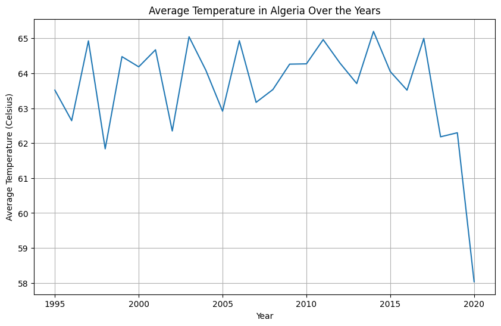

# AI Code Execution with Mistral's Codestral

This project tests the capabilities of the new Mistral's model on data analysis tasks, using the [Code Interpreter SDK](https://github.com/e2b-dev/code-interpreter) by E2B. Codestral doesn't support using tools yet, so in this Python example, we added the code interpreting capabilities.

We are going to build an AI assistant that performs data analysis on a CSV file. It is prompted to plot the average temperature over the years in Algeria,


# Installation

## 1. Install dependencies

Ensure all dependencies are installed:

```
npm install
```

## 2. Set up environment variables

Create a `.env` file in the project root directory and add your API keys:

- Copy `.env.template` to `.env`
- Get the [E2B API KEY](https://e2b.dev/docs/getting-started/api-key)
- Get the [MISTRAL API KEY](https://console.mistral.ai/api-keys/)

## 3. Run the program

```
npm run start
```

The script performs the following steps:
    
- Loads the API keys from the environment variables.
- Uploads the `city_temperature.csv` dataset to the E2B sandboxed cloud environment.
- Sends a prompt to the Codestal model to generate Python code for analyzing the dataset.
- Executes the generated Python code using the E2B Code Interpreter SDK.
- Saves any generated visualization as PNG file.
  

After running the program, you should get the result of the data analysis task saved in a `image_1.png` file. You should see the plot of average temperature in Algeria evolving in time, something like this:




# Connect with E2B & learn more
If you encounter any problems, please let us know at our [Discord](https://discord.com/invite/U7KEcGErtQ).

If you want to let the world know about what you're building with E2B, tag [@e2b_dev](https://twitter.com/e2b_dev) on X (Twitter).

Check the [documentation](https://e2b.dev/docs) to learn more about how to use E2B.