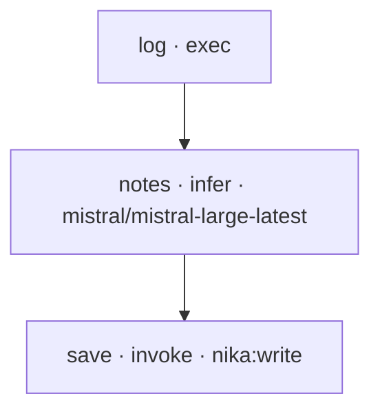

# Nika: statically-checked Mistral workflows

[Nika](https://github.com/supernovae-st/nika) turns a repeated AI job into one
plain-text `.nika.yaml` file: a small DAG that is **statically audited before a
single token is spent** and leaves a hash-chained trace after it runs. This
example orchestrates Mistral to draft release notes from a git log.

## Why it pairs well with Mistral

Run `nika check` and you get a receipt before anything executes:

```
✔ COST     $0.0012 - $0.0012 worst-case ceiling
✔ SECRETS  no information-flow escapes
✔ PERMITS  body fits the declared boundary
```

The cost ceiling is real because Mistral is in the model catalog: the checker
prices `mistral-large-latest` from the declared token cap. You see what a run
can cost, which secrets flow where, and the whole plan, before you spend.

## Run it

```bash
brew install supernovae-st/tap/nika    # single binary
export MISTRAL_API_KEY=...

nika check release-notes.nika.yaml     # the receipt, before any token
nika run   release-notes.nika.yaml     # git log -> Mistral -> RELEASE_NOTES.md
```

## The workflow, drawn by nika itself



Three tasks: read the git log, draft the notes with Mistral, save. The
`permits:` boundary is declared tight (exec may only launch git, the only tool
is `nika:write`), so the checker enforces it and everything else is
default-deny.

Swap `mistral-large-latest` for `mistral-small-latest` to cut the cost ceiling,
or point `model:` at any other provider in one line. The logic does not change.

Engine is AGPL-3.0; the language spec is Apache-2.0. Contributed by the Nika author.
