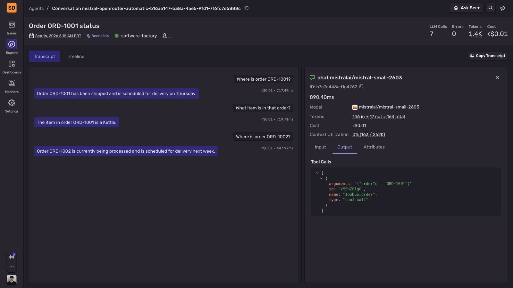
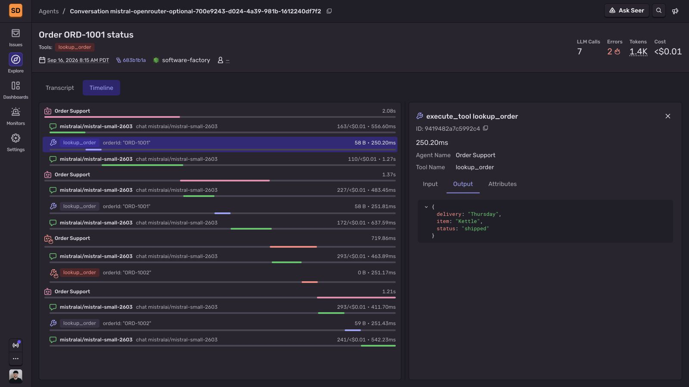
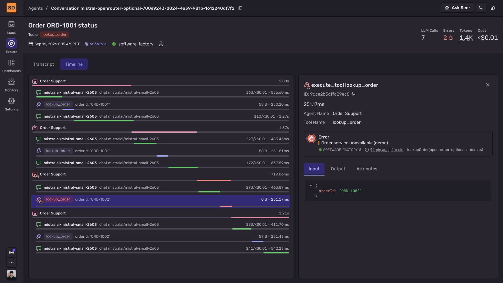

# Monitor a Mistral support agent with Sentry

Author: Sergiy Dybskiy ([@sergical](https://github.com/sergical)), Sentry.

Run a TypeScript support assistant that looks up fictional orders and answers follow-up questions. Sentry traces Mistral SDK calls automatically, including tool requests, streamed replies, and token usage. Optional application spans show the local lookup duration and connect a deliberate tool failure to its trace.

Screenshots show fictional orders and the native Mistral SDK tested through OpenRouter, which explains the model identifier. The setup below uses Mistral directly.

## Before you start

You need Node.js 24.12 or later, pnpm, a [Mistral API key](https://console.mistral.ai/) with access to a model that supports tool calling, and a [Sentry project](https://sentry.io/signup/) with its DSN.

Clone the [Sentry agent tracing examples](https://github.com/getsentry/sentry-agent-tracing-examples/tree/main/mistral-support). The example pins `@sentry/node` to `11.0.0-rc.0` and `@mistralai/mistralai` to `2.7.0`. This Sentry release candidate includes the native Mistral integration.

```bash
git clone https://github.com/getsentry/sentry-agent-tracing-examples.git
cd sentry-agent-tracing-examples/mistral-support
pnpm install --frozen-lockfile
cp .env.example .env
```

Set `SENTRY_DSN` and `MISTRAL_API_KEY` in `.env`. The example uses `mistral-small-latest`; set `MISTRAL_MODEL` to use another model that supports tool calling. Keep `.env` out of version control.

## 1. Configure Sentry

Open `instrument.ts` in the example project. Sentry’s native Mistral integration is enabled by default when tracing is on. It traces `chat.complete` and `chat.stream` automatically. Record model inputs and outputs for the fictional data, and sample every call while you verify the setup. HTTP body and local-variable capture stay off; model content comes from the AI integration.

**instrument.ts**

```typescript
import * as Sentry from "@sentry/node";

Sentry.init({
  dsn: process.env.SENTRY_DSN,
  tracesSampleRate: 1.0,
  dataCollection: {
    genAI: { inputs: true, outputs: true },
    httpBodies: [],
    stackFrameVariables: false,
  },
});
```

[Agent tracing in Node.js](https://docs.sentry.io/platforms/javascript/guides/node/agent-tracing/).

## 2. Review the order lookup tool

Open `orders.ts`. It defines the tool available to Mistral and the lookup that runs in your app. Two in-memory records stand in for an order service, with a simulated 250 ms delay. This is ordinary application code. The integration records the model’s tool request and the result passed back to Mistral; measuring the local function is an optional addition later.

**orders.ts**

```typescript
import { setTimeout } from "node:timers/promises";
import type { Tool, ToolCall } from "@mistralai/mistralai/models/components";

const orders = new Map([
  ["ORD-1001", { status: "shipped", item: "Kettle", delivery: "Thursday" }],
  ["ORD-1002", { status: "processing", item: "Mug", delivery: "Next week" }],
]);

export const orderTool = {
  type: "function",
  function: {
    name: "lookup_order",
    description: "Look up the current status of an order by its ID.",
    parameters: {
      type: "object",
      properties: { orderId: { type: "string", description: "For example, ORD-1001" } },
      required: ["orderId"],
      additionalProperties: false,
    },
  },
} satisfies Tool;

export async function lookupOrder(call: ToolCall, failLookup: boolean): Promise<string> {
  if (call.function.name !== "lookup_order") throw new Error("Unknown tool");
  const args: unknown = typeof call.function.arguments === "string"
    ? JSON.parse(call.function.arguments)
    : call.function.arguments;
  if (typeof args !== "object" || args === null ||
      !("orderId" in args) || typeof args.orderId !== "string") {
    throw new Error("Missing orderId");
  }

  await setTimeout(250);
  if (failLookup) throw new Error("Order service unavailable (demo)");
  return JSON.stringify(orders.get(args.orderId) ?? { status: "not_found" });
}
```

## 3. Follow the agent workflow

Open `assistant.ts`. Mistral chooses the order ID, your app runs the lookup, and a second model call streams the answer. The native integration traces both SDK calls automatically. This example requires one tool call per turn. Completed turns remain in history for follow-up questions; failed turns leave that history unchanged.

**assistant.ts**

```typescript
import { Mistral } from "@mistralai/mistralai";
import type { ChatCompletionRequest } from "@mistralai/mistralai/models/components";
import { orderTool, lookupOrder } from "./orders.ts";

const mistral = new Mistral({ apiKey: process.env.MISTRAL_API_KEY });
const model = process.env.MISTRAL_MODEL || "mistral-small-latest";

export const history: ChatCompletionRequest["messages"] = [{
  role: "system",
  content: "You help with order status. Use lookup_order for each question. " +
    "Use only the returned order data. Keep answers to two short sentences.",
}];

export async function answer(question: string, failLookup = false): Promise<string> {
  const messages: ChatCompletionRequest["messages"] = [...history, { role: "user", content: question }];
  const response = await mistral.chat.complete({
    model, messages, tools: [orderTool],
    toolChoice: "any", parallelToolCalls: false,
  });
  const message = response.choices?.[0]?.message;
  const call = message?.toolCalls?.[0];
  if (!message || !call?.id || message.toolCalls?.length !== 1) {
    throw new Error("Expected one order lookup");
  }

  messages.push({ role: "assistant", content: message.content, toolCalls: message.toolCalls });
  const result = await lookupOrder(call, failLookup);
  messages.push({ role: "tool", toolCallId: call.id, content: result });

  const stream = await mistral.chat.stream({ model, messages });
  let reply = "";
  for await (const event of stream) {
    const content = event.data.choices?.[0]?.delta.content;
    const text = typeof content === "string" ? content : (content ?? [])
      .filter((part) => part.type === "text")
      .map((part) => part.text).join("");
    reply += text;
    process.stdout.write(text);
  }
  process.stdout.write("\n");
  history.push(...messages.slice(history.length), { role: "assistant", content: reply });
  return reply;
}
```

[Mistral tool calling](https://docs.mistral.ai/capabilities/function_calling/).

## 4. Start a support conversation

Run these commands from the example project. The start script loads `instrument.ts` before `app.ts` imports the Mistral SDK. The terminal stays open for follow-up questions. The conversation ID groups related model calls in Sentry, and flushing after each turn sends events while the app stays running. No manual spans are needed for this setup.

### App

**app.ts**

```typescript
import { randomUUID } from "node:crypto";
import { createInterface } from "node:readline/promises";
import * as Sentry from "@sentry/node";
import { answer } from "./assistant.ts";

const terminal = createInterface({ input: process.stdin, output: process.stdout });
const conversationId = randomUUID();
Sentry.setConversationId(conversationId);
console.log(`Conversation: ${conversationId}`);
console.log("Ask about ORD-1001 or ORD-1002. Commands: /fail, /quit");
let failNextTurn = false;

try {
  while (true) {
    const question = (await terminal.question("You: ")).trim();
    if (question === "/quit") break;
    if (!question) continue;
    if (question === "/fail") {
      failNextTurn = true;
      console.log("The next order lookup will fail.");
      continue;
    }
    try {
      process.stdout.write("Assistant: ");
      await answer(question, failNextTurn);
    } catch (error) {
      const message = error instanceof Error ? error.message : String(error);
      console.error(`\nRequest failed: ${message}. Ask again to retry.`);
    } finally {
      failNextTurn = false;
      await Sentry.flush(2000);
    }
  }
} finally {
  terminal.close();
  await Sentry.flush(2000);
}
```

### Run

**Terminal**

```bash
pnpm typecheck
pnpm start
```

- Ask **Where is order ORD-1001?** The reply should use the shipped status and Thursday delivery from the tool result.
- Ask **What item is in that order?** The assistant should use the previous turn to identify ORD-1001, look it up, and answer Kettle.
- Leave the terminal open while you inspect the conversation. Type `/quit` when you finish.

## 5. Read the support conversation

Open [Explore > Agents](https://sentry.io/orgredirect/organizations/:orgslug/explore/agents/), select your project, and find the conversation ID printed in the terminal. Choose **Transcript** to read the questions, answers, and follow-up as one conversation. The conversation ID groups related model calls even when they belong to separate traces. The basic setup is complete; the remaining steps are optional.



*The Transcript tab stays visible while the sidebar shows the model’s lookup_order request, arguments, duration, and token counts.*

- **Conversation:** check that the first answer uses the shipped status and Thursday delivery, and that the follow-up identifies the item as Kettle.
- **Model details:** in **Timeline**, select the first model call and open **Output**, then return to **Transcript** to keep its details beside the conversation. The sidebar shows the tool request, duration, and token counts. The second call’s **Input** contains the tool result.
- **Local lookup:** this setup has no tool execution span. The optional steps add its duration, result, and error details.

[Explore agent conversations](https://docs.sentry.io/product/agents/conversations/).

## 6. Add agent and tool spans (optional)

Use this extension when you want one trace for the whole turn and timing for your application’s lookup. Open the included `tracing.ts`, then apply the edits under **Connect** below. The agent span groups the turn; the tool span measures the local lookup. The two Mistral spans still come from the integration. The wrapper captures errors inside the active agent span so an issue can link to that trace.

### Tracing helpers

**tracing.ts**

```typescript
import * as Sentry from "@sentry/node";
import type { ToolCall } from "@mistralai/mistralai/models/components";
import { lookupOrder as runLookupOrder } from "./orders.ts";

export function traceTurn<T>(run: () => Promise<T>): Promise<T> {
  return Sentry.startSpan(
    {
      name: "invoke_agent Order Support",
      op: "gen_ai.invoke_agent",
      attributes: {
        "gen_ai.operation.name": "invoke_agent",
        "gen_ai.agent.name": "Order Support",
      },
    },
    async () => {
      try {
        return await run();
      } catch (error) {
        Sentry.captureException(error);
        throw error;
      }
    },
  );
}

export function lookupOrder(call: ToolCall, failLookup: boolean): Promise<string> {
  return Sentry.startSpan(
    {
      name: "execute_tool lookup_order",
      op: "gen_ai.execute_tool",
      attributes: {
        "gen_ai.operation.name": "execute_tool",
        "gen_ai.tool.name": "lookup_order",
        "gen_ai.tool.call.id": call.id,
        "gen_ai.tool.call.arguments": typeof call.function.arguments === "string"
          ? call.function.arguments : JSON.stringify(call.function.arguments),
      },
    },
    async (span) => {
      try {
        const result = await runLookupOrder(call, failLookup);
        span.setAttribute("gen_ai.tool.call.result", result);
        return result;
      } catch (error) {
        span.setStatus({ code: 2, message: "internal_error" });
        span.setAttribute("error.type", error instanceof Error ? error.name : "Error");
        throw error;
      }
    },
  );
}
```

### Connect

**Update assistant.ts and app.ts**

```typescript
// assistant.ts: replace the import from orders.ts with these two imports.
import { orderTool } from "./orders.ts";
import { lookupOrder } from "./tracing.ts";

// app.ts: add this import.
import { traceTurn } from "./tracing.ts";

// app.ts: replace await answer(question, failNextTurn) inside the try block.
await traceTurn(() => answer(question, failNextTurn));
```

- Type `/quit`, restart with the command from step 4, and ask about ORD-1001 again. Restarting creates a new conversation ID.

## 7. Inspect the tool execution (optional)

After you add the spans in step 6, open the new conversation’s **Timeline**. Select **lookup_order** and open **Output** to inspect the returned order. The screenshot shows the local function’s duration and result alongside the automatic model calls.

- Open the new trace: invoke_agent Order Support contains two automatic model spans and one manual execute_tool lookup_order span.
- Inspect the lookup’s arguments, returned order, and roughly 250 ms duration. The manual argument/result attributes use fictional data; omit or redact them for sensitive records.



*Optional instrumentation records the local lookup duration and returned order. The model calls still come from the native integration.*

[Add application context to AI traces](https://docs.sentry.io/platforms/javascript/guides/node/agent-tracing/manual-instrumentation/).

## 8. Debug a tool failure (optional)

Complete step 6 first, then enter these lines in the running assistant. The `/fail` command makes the next lookup throw. The first Mistral call should complete, but the tool fails before the second model call starts. The optional wrapper records the application error, and the terminal stays open for a retry.

**Enter at the You: prompt**

```text
/fail
Where is order ORD-1002?
```

- Open [Issues](https://sentry.io/orgredirect/organizations/:orgslug/issues/) and find **Order service unavailable (demo)**. Follow its trace link.
- Find the failed execute_tool lookup_order span and the stack frame in orders.ts. There should be no second model span because answer generation never started.
- Ask **Where is order ORD-1002?** again. The failure resets after one turn. The retry should include a successful lookup and a second model call that streams the answer.
- Compare the failed turn and retry in the same conversation. The lookup failed in application code; the first model call succeeded.



*The selected tool span contains the deliberate application error. The first model call succeeds; the retry appears in the next trace group.*

[Connect captured errors to traces](https://docs.sentry.io/platforms/javascript/guides/node/usage/).

## Control recorded content

Set `dataCollection.genAI.inputs` and `dataCollection.genAI.outputs` to false in `instrument.ts`. The example also disables HTTP body and local-variable capture. If you add the optional `tracing.ts` module, omit or redact `gen_ai.tool.call.arguments` and `gen_ai.tool.call.result` there too. The SDK’s data collection options do not control those manual attributes. Model metadata, timing, and token usage remain available.

## Troubleshooting

- Treating a model’s tool request as proof the tool ran. Check the returned data in the next model call, or add the optional tool span to measure execution.
- Expecting prompt-recording options to control optional manual attributes. Redact tool arguments and results separately when you add them.
- Loading Sentry after Mistral, or also enabling Mistral’s OpenTelemetry instrumentation. Keep the --import startup command and avoid recording the same model call twice.

Sentry needs token counts and a model name that matches its pricing data. Newly released, custom, or unrecognized models may have no estimate. See the [model cost documentation](https://docs.sentry.io/product/agents/costs/).

## Use a real order service

Replace the in-memory lookup and simulated delay in `orders.ts`. Validate model-generated arguments and enforce the signed-in user’s access to each order before returning data. This terminal demo has no authentication and uses fictional orders only.
