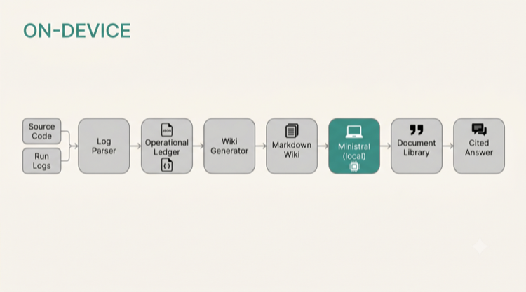

# Architecture

## Overview

The running system is an **autonomous agent** (Robot Ross) that receives orders, decides how to fulfil them, acts in the physical world, and emits a structured event for everything it does. This document describes the layer that turns those events plus the agent's source code into a cited, queryable wiki — the agent's grounded operational memory.

The pipeline has four layers. Each has a clearly defined input and output format and can be used independently.

```
source code + operational logs
        │
        ▼
[Layer 1: Compiled Wiki]        ← ledger_to_md.py turns JSONL events into Markdown pages
        │
        ▼
[Layer 2: Operational Ledger]   ← JSONL, one event per line, append-only
        │
        ├──────────────────────────────────────────────┐
        ▼                                              ▼
[Layer 3: Cited Q&A]                    [Structured Outputs analysis]
  Document Library + Citations           typed JSON: patterns / anomalies
  hosted or local Ministral              ledger slice → metrics / recommendations
        │
        ▼
[Layer 4: Voice  (optional)]    ← Voxtral in / Voxtral out
        │
        ▼
    operator
```

---

## Pipeline Diagram



*Source Code + Run Logs → Log Parser → Operational Ledger → Wiki Generator → Markdown Wiki → Ministral (local) / Mistral (hosted) → Document Library → Cited Answer*

---

## Data Flow

```
source files ──┐
               ├──► ledger_to_md.py ──► wiki/*.md ──► Mistral Document Library ──► agents.complete() ──► cited answer
run logs       │                                                                          ▲
(JSONL) ───────┘                                                                    runtime_adapter
                                                                              (hosted Mistral or local Ministral)
               └──► Structured Outputs ──► typed JSON schema
                    (log analysis cell)    patterns / anomalies / metrics
```

The same JSONL ledger feeds both paths. The wiki path is for long-form knowledge retrieval with citations. The Structured Outputs path is for machine-readable analysis of a specific run slice.

---

## Layer 1 — Compiled Wiki

**Input:** source code files + JSONL run logs  
**Output:** Markdown pages, one per component, topic, or session

`ledger_to_md.py` reads structured run events and emits a Markdown page per session capturing timeline, milestones, and notable events. Source-code context pages (Overview, Subsystems, Topics) are written once and updated when the code changes.

The intellectual lineage is Karpathy's LLM-wiki pattern: distil code and logs into a compact, queryable corpus rather than asking the model to answer from raw source on every request. The difference is that this corpus is generated from telemetry rather than written by hand, so it can be regenerated from the latest logs at any time.

---

## Layer 2 — Operational Ledger

**Input:** events emitted by the running agent  
**Output:** JSONL file, one JSON object per line, append-only

Each event has at minimum: `ts` (ISO-8601), `action` (string key), `payload` (arbitrary dict).

```jsonc
{"ts": "2026-03-19T12:42:00Z", "action": "ai_request", "payload": {"prompt": "...", "model": "mistral-large-latest"}}
{"ts": "2026-03-19T12:47:00Z", "action": "job_end",    "payload": {"status": "complete", "duration_s": 300}}
```

The ledger is ground truth; the wiki is derived from it. Re-run `ledger_to_md.py` on new logs and the wiki reflects the current state. Nothing is written by hand — which is what lets the wiki double as a faithful record of what the agent actually did, not what someone hoped it did.

---

## Layer 3 — Cited Q&A

**Input:** wiki corpus (Markdown)  
**Output:** natural-language answers with citations to source documents

The corpus is uploaded to a **Mistral Document Library**. Queries go to an agent configured with the `document_library` tool. Mistral Citations returns answers with reference IDs pointing to the specific document and section used.

### Model stack

| Task | Model | Notes |
| :--- | :--- | :--- |
| Wiki corpus Q&A | `mistral-large-latest` | agent with `document_library` tool |
| Structured Outputs — log analysis | `mistral-large-latest` | JSON schema, extracts patterns / anomalies |
| Local fallback | Ministral 3B via Ollama | `tools/runtime_adapter.py --check` |

No other providers are required — the stack is Mistral end to end.

### Switching hosted ↔ local

`tools/runtime_adapter.py` tries hosted Mistral first and falls back to a local Ministral 3B model via Ollama. Set `MISTRAL_LOCAL=1` to force local. Corpus generation (Layer 1) runs entirely offline; only the Document Library upload and Q&A steps require network access.

---

## Layer 4 — Voice (optional)

**Input:** spoken question (audio)  
**Output:** spoken answer (audio)

Voxtral Transcribe 2 converts the spoken question to text; the text query goes through Layer 3 exactly as a typed question would; Voxtral TTS synthesises the cited answer as speech. Optional, demonstrated in the final notebook cell, and does not change the Q&A pipeline. The stack stays fully Mistral on both audio ends.

---

## Design Decisions

**Provenance / citations.** Every answer must cite its source. Not a nicety — it's the only way to verify the answer is grounded in actual log data rather than model prior knowledge. Document Library + Citations is the implementation of that requirement.

**Local-first option.** Corpus generation has no network dependency. An air-gapped deployment can generate the wiki offline and upload only when ready. The `runtime_adapter` makes the local/hosted switch a single environment variable.

**Graceful fallback to corpus-only.** If a question has no answer in the corpus, the agent says so explicitly. Letting the model answer from its training weights would undermine the citation guarantee, so the agent instructions prohibit answers not grounded in the provided documents.

---

## From Inference-Time Grounding to Training-Time Grounding

Everything above grounds a *stock* Mistral model at **inference time**: the model is general-purpose, and the wiki corpus is supplied as retrieval context per query, with citations proving the answer came from the corpus rather than the weights.

The deeper version of the same goal is grounding a model at **training time** — encoding the codebase, operational records, and institutional vocabulary into the model's own behaviour. That is precisely what [Mistral Forge](https://mistral.ai/news/forge/) is built for: training frontier-grade models on an organisation's proprietary code and operational data so agents reason in the environment's own terminology and constraints.

This system is the inference-time cousin of that idea, and the corpus it compiles — structured, regenerable, drawn straight from code and telemetry — is the kind of input a Forge training pipeline consumes. We built the inference-time version because it is what is buildable today without Forge access; pre-/post-training a custom model on this same corpus is the natural next step.
