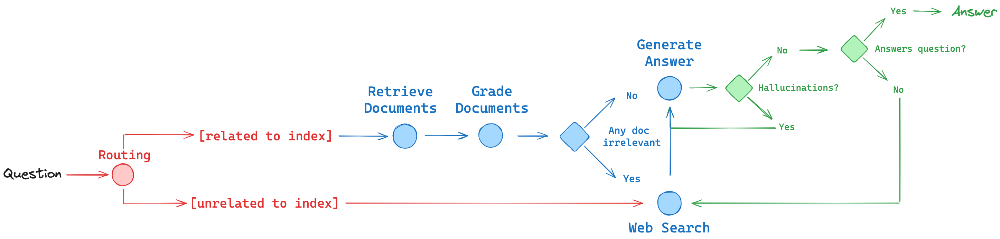
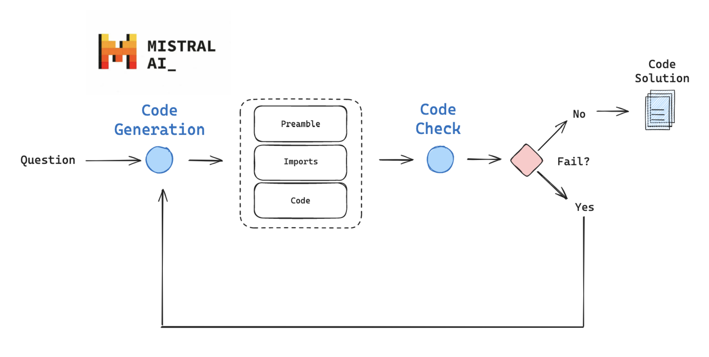

# LangChain <> MistralAI Cookbooks

Agents use LLMs to direct the control flow of an application. LangGraph is a library that helps you build reliable agents. 

* See our [slides](https://docs.google.com/presentation/d/1O5v1qFMQEe430aynnaq-4gR0cMvqSsYfsaHJ4RoHpoE/edit?usp=sharing). 
* See our free course on LangGraph [here](https://academy.langchain.com/courses/intro-to-langgraph).

We'll show how to use LangGraph to build agent examples for RAG and Code Generation.

## RAG

We'll apply LangGraph to a build RAG agent that uses ideas from 3 papers:

* Document grading (CRAG [paper](https://arxiv.org/pdf/2401.15884.pdf)) - uses self-grading on retrieved documents and web-search fallback if documents are not relevant.
* Generation grading (Self-RAG [paper](https://arxiv.org/abs/2310.11511)) - adds self-grading on generations for hallucinations and for ability to answer the question.
* Routing ([paper](https://arxiv.org/abs/2403.14403)) - routes queries between different RAG approaches based on their complexity.

Video overview:

* https://www.youtube.com/watch?v=sgnrL7yo1TE

--- 

## Code generation

We'll combine the code generation capabilities of Codestral with the self-correction approach presented in the [AlphaCodium](https://github.com/Codium-ai/AlphaCodium) paper, [constructing an answer to a coding question iteratively](https://x.com/karpathy/status/1748043513156272416?s=20).  

We will implement some of these ideas from scratch using [LangGraph](https://python.langchain.com/docs/langgraph): 

1) Produce structured code generation output from Codestral-instruct

2) Perform inline unit tests to confirm imports and code execution work

3) Feed back any errors for Codestral for self-correction.

Video overview:

* https://youtu.be/zXFxmI9f06M
