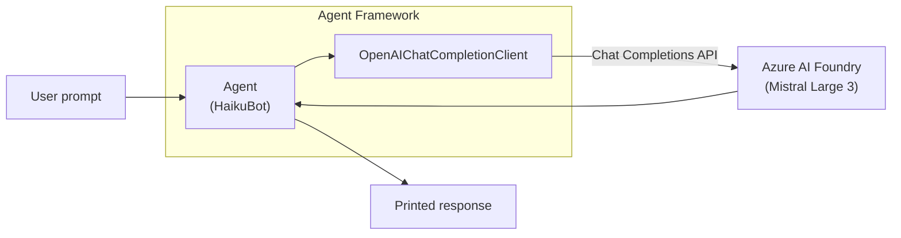
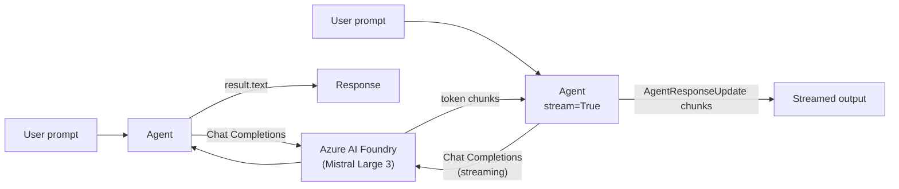
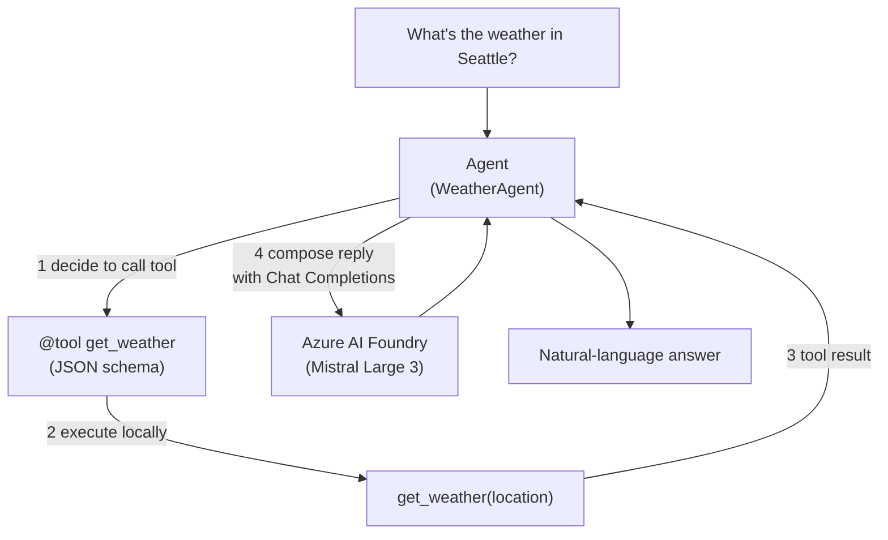
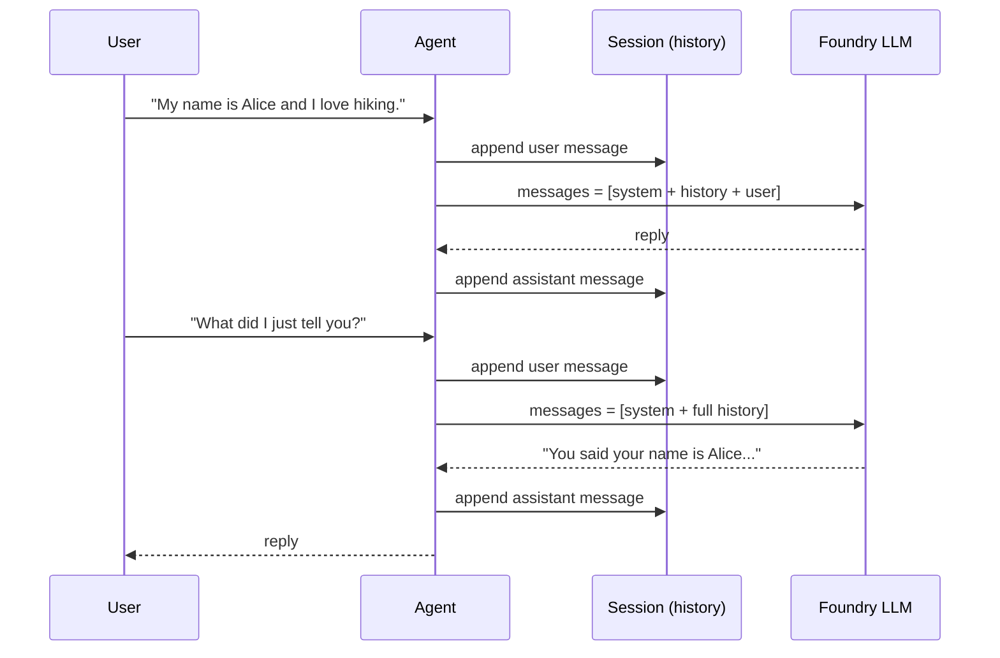
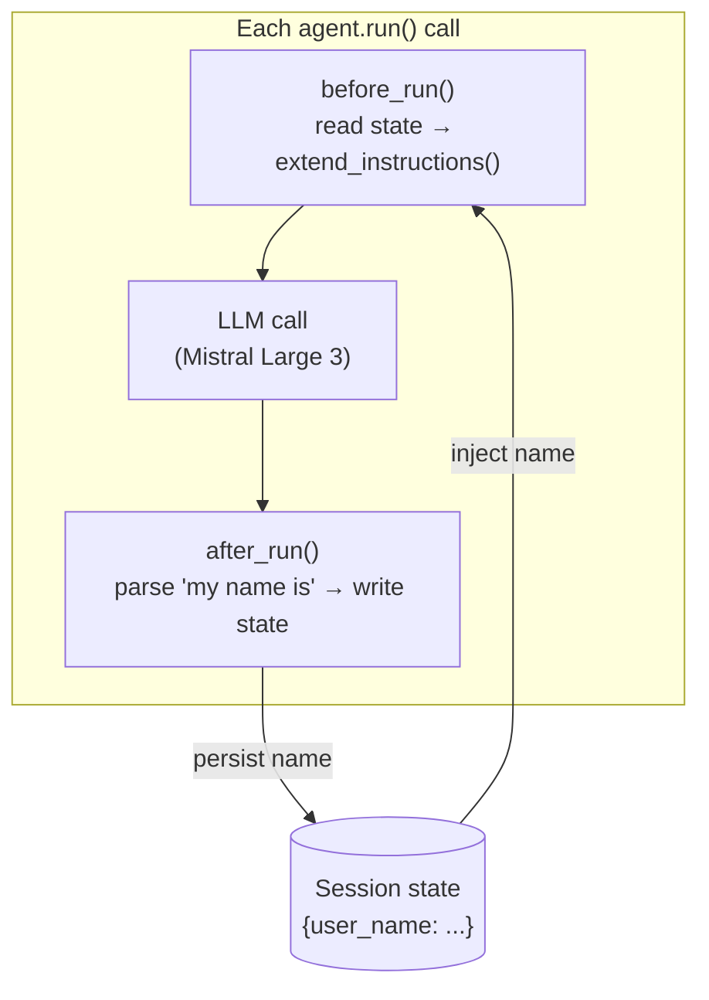
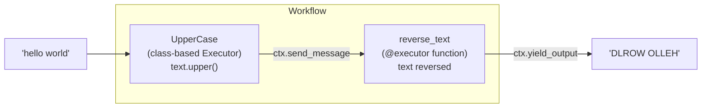
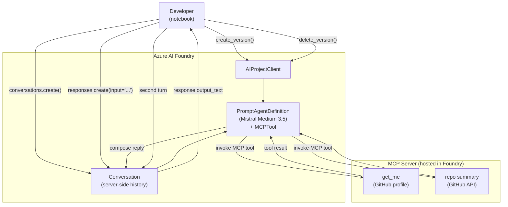
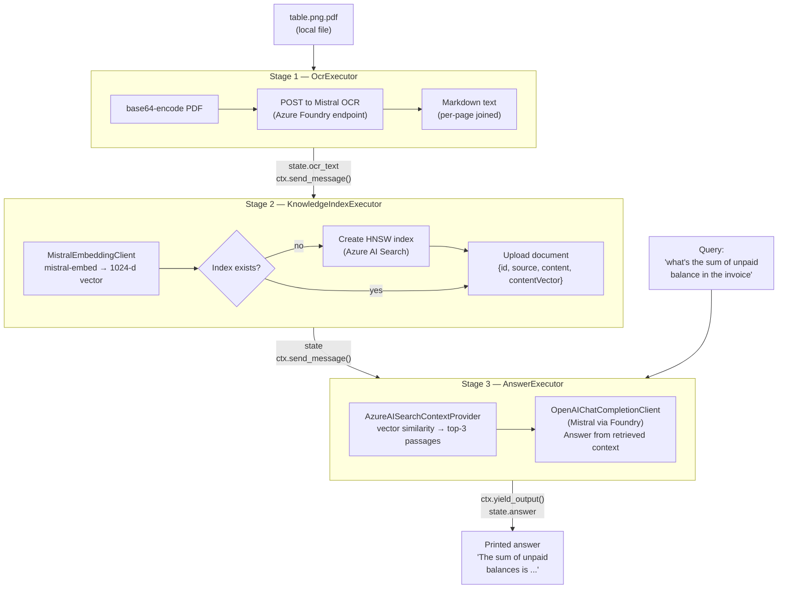

# Microsoft Agent Framework — CookBook

Hands-on notebooks and scripts for building agents and agentic workflows with the
**Microsoft Agent Framework** on **Azure AI Foundry**, using **Mistral** models.

---

## Contents

| File | Description |
|------|-------------|
| [`BasicAgent.py`](BasicAgent.py) | Minimal runnable script — one agent, one question |
| [`Agent_Framework_Demo.ipynb`](Agent_Framework_Demo.ipynb) | Six progressive patterns: basic → tools → MCP → sessions → memory → workflows |
| [`Foundry_Agent_Tool_Calling.ipynb`](Foundry_Agent_Tool_Calling.ipynb) | Foundry agent with a remote MCP tool server (GitHub API) |
| [`OCR-RAG-Agentic-Workflow.ipynb`](OCR-RAG-Agentic-Workflow.ipynb) | Three-stage pipeline: PDF OCR → vector index → RAG answer |

---

## Setup

1. Copy `env.example` to `.env` and fill in your values.
2. Log in with the Azure CLI: `az login`
3. Install dependencies (each notebook has a `%pip install` cell at the top).

### Required environment variables

| Variable | Used by | Purpose |
|----------|---------|---------|
| `AZURE_AI_PROJECT_ENDPOINT` | all | Azure AI Foundry project URL |
| `AZURE_AI_DEPLOYMENT_NAME` | Demo, Foundry | Deployed Mistral model name |
| `AZURE_AI_QNA_MODEL` | OCR-RAG | Model for the answering stage |
| `AZURE_AI_OCR_NAME` | OCR-RAG | Mistral OCR deployment name |
| `MISTRAL_OCR_ENDPOINT` | OCR-RAG | Mistral OCR REST endpoint |
| `MISTRAL_API_KEY` | OCR-RAG | API key for OCR + embeddings |
| `AZURE_MISTRAL_EMBEDDING_MODEL` | OCR-RAG | Embedding model (`mistral-embed`) |
| `AZURE_SEARCH_ENDPOINT` | OCR-RAG | Azure AI Search service URL |
| `AZURE_SEARCH_INDEX_NAME` | OCR-RAG | Index to create or reuse |
| `AZURE_SEARCH_API_KEY` | OCR-RAG | Optional — falls back to CLI auth |
| `AZURE_SEARCH_SEMANTIC_CONFIG` | OCR-RAG | Optional semantic ranker config |
| `MCP_SERVER_URL` | Foundry | Hosted MCP server HTTPS URL |
| `MCP_CONNECTION_NAME` | Foundry | Foundry connection ID for MCP credentials |
| `PROJECT_API_NAME` | Foundry | API path suffix for `AIProjectClient` |

---

## Architecture Diagrams

### 1 — BasicAgent.py

The simplest possible pattern: one agent, one synchronous call.



---

### 2 — Agent_Framework_Demo.ipynb

Six patterns in one notebook, building up from a basic agent to a full workflow.

#### 2a — Basic agent (non-streaming & streaming)



#### 2b — Tool calling



#### 2c — Multi-turn sessions



#### 2d — Memory via ContextProvider



#### 2e — Workflow (UpperCase → reverse_text)



---

### 3 — Foundry_Agent_Tool_Calling.ipynb

A Foundry-managed agent uses a remote **Model Context Protocol (MCP)** server to call GitHub APIs across a multi-turn conversation.



---

### 4 — OCR-RAG-Agentic-Workflow.ipynb

A three-stage linear workflow. Each executor has one responsibility; the Agent Framework routes state between them automatically.



#### Data flow summary

```
table.png.pdf
      │
      ▼  base64 + HTTP POST
 Mistral OCR  ──────────────────────────► Markdown text
                                               │
                                               ▼  mistral-embed (1024-d)
                                        Azure AI Search index
                                               │
                                               ▼  vector similarity (top-3)
 Query ──────────────────────────────► Grounding context
                                               │
                                               ▼  Chat Completions
                                        Mistral (Foundry)
                                               │
                                               ▼
                                         Final answer
```

---

## Key Concepts

| Concept | Description |
|---------|-------------|
| `Agent` | Wraps an LLM client with instructions, tools, and context providers |
| `OpenAIChatCompletionClient` | Connects to any OpenAI-compatible endpoint (e.g. Azure AI Foundry) |
| `@tool` | Decorator that exposes a Python function as a callable tool for the LLM |
| `MCPTool` | Declares a remote Model Context Protocol server as a tool source |
| `Session` | Carries conversation history across multiple `agent.run()` calls |
| `ContextProvider` | Injects dynamic system-prompt content and reads responses each turn |
| `Executor` / `@executor` | A single stage in a workflow — receives state, transforms it, forwards it |
| `WorkflowBuilder` | Wires executors into a directed graph and builds a runnable workflow |
| `ctx.send_message()` | Forwards state to the next executor in the pipeline |
| `ctx.yield_output()` | Marks the terminal result of a workflow |

---

## References

- [Microsoft Agent Framework](https://github.com/microsoft/agent-framework)
- [Azure AI Foundry documentation](https://learn.microsoft.com/en-us/azure/ai-foundry/)
- [Mistral on Azure AI Foundry](https://learn.microsoft.com/en-us/azure/ai-foundry/models/mistral)
- [Azure AI Foundry MCP tools](https://learn.microsoft.com/en-us/azure/foundry/agents/how-to/tools/model-context-protocol?pivots=python)
- [Azure AI Search vector search](https://learn.microsoft.com/en-us/azure/search/vector-search-overview)
