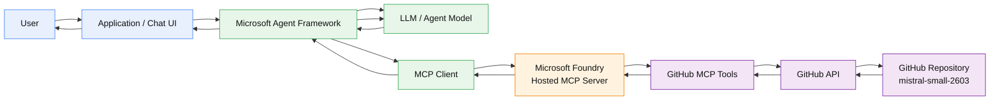

# Microsoft Agent Framework → Foundry MCP → GitHub Repository Q&A

This project demonstrates an architecture where an application uses the **Microsoft Agent Framework** to interact with an **MCP server hosted in Microsoft Foundry**, which in turn exposes GitHub repository tools. The agent can answer questions such as:

- `Who is the owner of the mistral-small-2603 repository?`
- `Can you summarize the mistral-small-2603 repository?`
- `What are the main components in this repository?`
- `Show me the README and explain how to run the project.`

## Architecture



### Request flow

For a question such as:

> **Can you summarize the `mistral-small-2603` repository?**

the high-level flow is:

1. The user sends the question to the application.
2. The application invokes the Microsoft Agent Framework.
3. The agent determines that repository information is required.
4. The MCP client connects to the MCP server hosted in Microsoft Foundry.
5. The MCP server exposes GitHub-related tools.
6. The agent selects the appropriate MCP tool(s), for example:
   - search/find the repository
   - retrieve repository metadata
   - retrieve files
   - retrieve the repository README
7. The MCP server calls GitHub through the configured GitHub integration/credentials.
8. GitHub returns the repository data.
9. The MCP server returns MCP tool results to the agent.
10. The model reasons over the returned repository content and produces a natural-language answer.

## Important architectural distinction

The **LLM does not directly call GitHub**.

Instead:

```text
User
  ↓
Microsoft Agent Framework
  ↓
LLM decides which tool is needed
  ↓
MCP client
  ↓
Foundry-hosted MCP server
  ↓
GitHub MCP tool
  ↓
GitHub API
```

The MCP server provides the tool abstraction and handles the interaction with GitHub. The model receives the tool definitions and tool results through the agent framework.

## Example questions

### Repository owner

```text
Who is the owner of the mistral-small-2603 repository?
```

A typical tool flow would be:

```text
Agent
  → GitHub repository metadata tool
  → GitHub API
  → repository metadata
  → Agent
  → "The repository is owned by ..."
```

### Repository summary

```text
Can you summarize the mistral-small-2603 repository?
```

The agent may need multiple tool calls:

```text
Agent
  ├─→ Find repository
  ├─→ Get repository metadata
  ├─→ Get README
  ├─→ Inspect relevant source/configuration files
  └─→ Synthesize answer
```

This is one of the main benefits of MCP: the agent can dynamically decide which capabilities it needs rather than the application having to implement every GitHub operation itself.

## Components

| Component | Responsibility |
|---|---|
| User / Chat UI | Sends natural-language questions |
| Application | Hosts the agent and manages the conversation |
| Microsoft Agent Framework | Orchestrates the agent, model, and tools |
| LLM | Understands the question, selects tools, and synthesizes the answer |
| MCP Client | Connects the agent to MCP tools |
| Microsoft Foundry | Hosts/provides the MCP server integration |
| GitHub MCP Server/Tools | Exposes GitHub operations through MCP |
| GitHub API | Provides repository metadata and file contents |
| GitHub Repository | Source of the information being queried |

## MCP tool interaction

Conceptually, the agent sees MCP tools similar to:

```text
get_repository(...)
get_file_contents(...)
search_code(...)
list_directory(...)
```

The exact tool names depend on the MCP server implementation/configuration.

For example, the model could decide to call:

```json
{
  "repository": "mistral-small-2603",
  "owner": "<repository-owner>"
}
```

The MCP layer handles the tool invocation and returns structured results to the agent.

## Security and identity

A production implementation should avoid putting GitHub credentials directly into prompts or application code.

A recommended trust boundary is:

```text
Application
    |
    | Agent/MCP protocol
    v
Foundry
    |
    | Managed authentication / connection
    v
GitHub
```

Use the authentication and connection mechanisms supported by the specific Foundry MCP integration and GitHub MCP server you deploy.

Consider:

- Least-privilege GitHub permissions
- Read-only access when repository Q&A is the only requirement
- Secret/credential management
- Network restrictions where applicable
- Audit logging
- Tool-level authorization
- Repository allowlists if the agent should only access approved repositories

## Why use MCP?

Without MCP, the application could implement GitHub-specific functions directly:

```text
Agent → Application code → GitHub SDK/API
```

With MCP:

```text
Agent → MCP → GitHub tools → GitHub
```

This provides a standardized tool interface and allows the same GitHub capabilities to be consumed by different MCP-compatible agents or applications.

## Example logical implementation

The application can conceptually be structured as:

```text
+----------------------------------------------------+
| Application                                        |
|                                                    |
|  User Question                                     |
|       |                                            |
|       v                                            |
|  Microsoft Agent Framework                         |
|       |                                            |
|       +------------------+                         |
|       |                  |                         |
|       v                  v                         |
|      LLM             MCP Client                    |
|       |                  |                         |
|       +------ tool ------+                         |
+--------------------------|-------------------------+
                           |
                           | MCP
                           v
              +--------------------------+
              | Microsoft Foundry        |
              | MCP Server               |
              +------------+-------------+
                           |
                           | GitHub tools
                           v
              +--------------------------+
              | GitHub API               |
              +------------+-------------+
                           |
                           v
              +--------------------------+
              | GitHub Repository        |
              | mistral-small-2603       |
              +--------------------------+
```

## Key design principle

The application should generally **not hard-code the decision about which GitHub API to call for every user question**.

Instead, the agent should have access to MCP tools and decide which tools are appropriate based on the user's request.

For example:

```text
"Who owns this repository?"
        ↓
Repository metadata tool

"Summarize this repository"
        ↓
Repository metadata
        +
README
        +
selected source/configuration files

"What dependencies does it use?"
        ↓
Package/configuration files
        +
possibly repository metadata
```

The agent can therefore perform multiple tool calls before generating the final response.

## Troubleshooting

### `404 Not Found` when accessing a repository

If an MCP GitHub tool returns a GitHub `404`, verify:

1. The repository owner/organization is correct.
2. The repository name is correct.
3. The GitHub connection used by the MCP server has access to the repository.
4. The repository is not private to a different account/organization.
5. The MCP server is receiving the expected repository identifier.
6. The GitHub token/application has sufficient repository permissions.

A GitHub `404` can indicate either that the repository does not exist or that the authenticated identity cannot access it.

### Tool is available but the agent does not call it

Check:

- MCP server connection is healthy.
- The tool is exposed to the agent.
- Tool descriptions clearly explain what each tool does.
- The agent instructions allow tool use.
- The model is receiving the MCP tool definitions.
- The repository identifier is unambiguous.

### Repository summary is incomplete

A repository summary should not necessarily rely only on the README.

For higher-quality answers, allow the agent to inspect:

- README
- directory structure
- package/dependency files
- configuration files
- representative source files
- documentation

The agent should avoid retrieving the entire repository unless necessary.

## Suggested agent instructions

A useful system/developer instruction for this scenario is:

```text
You are a GitHub repository assistant.

When answering questions about a repository, use the available GitHub MCP
tools rather than guessing.

For repository ownership questions, retrieve repository metadata.

For repository summaries, inspect the README and repository structure and,
when useful, inspect relevant configuration, dependency, and source files.

Clearly distinguish information retrieved from GitHub from your own inference.

If a repository cannot be found or accessed, explain the problem instead of
inventing repository information.
```

## Summary

The architecture separates **agent reasoning** from **external system access**:

```text
                    Reasoning
                       |
                       v
User → Agent Framework → LLM
              |
              | MCP tool calls
              v
        Foundry MCP Server
              |
              | GitHub operations
              v
          GitHub API
              |
              v
          Repository
```

This makes the GitHub integration a reusable MCP capability while allowing the Microsoft Agent Framework to handle agent orchestration, tool selection, and response generation.
