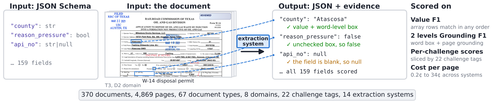

# ExtractBench

[](https://www.extractbench.ai/)
[](https://arxiv.org/abs/2607.29677)
[](https://huggingface.co/datasets/llamaindex/ExtractBench)
[](LICENSE)

**ExtractBench** is a benchmark for **schema-guided extraction** from enterprise documents. Given a document and a user-defined JSON Schema, a system must return schema-valid JSON with the correct values, *every* record of each repeated structure, missing fields marked `null` rather than invented, and source evidence for each value.

A schema defines one extraction task, and all documents of that type share it: one invoice schema covers invoices from every vendor, however different each one looks. Enterprises write a new schema for almost every workflow, so a system cannot be tuned to a fixed template. It has to handle schemas and documents it has never seen. And because agents increasingly act on extracted values before anyone reviews them, one truncated schedule or one invented value becomes a wrong payment or a wrong decision. The benchmark therefore scores completeness and traceability.

The benchmark covers **370 documents (4,869 pages)** across 8 business domains and 67 document types, each type with its own schema. Every document is tagged along five independent axes: task challenge, perception challenge, table structure, length, and business domain, so a low score can be traced to its cause.

<p align="center">
  
</p>

## Leaderboard

Models and prices reflect each provider's official documentation as of July 1, 2026; each system uses its recommended configuration.

<!-- LEADERBOARD:START -->
**Unified value F1** — the headline metric. Every score is an unweighted mean over documents; each document counts once, whatever its length. For raw data including per-split precision and recall, cost, and latency, see [leaderboard.csv](leaderboard.csv). The best score in each Overall, Short, Medium, and Long column is **bold**; the second-best distinct score is <u>underlined</u>.

| Rank | Provider | Category | Overall | Short | Medium | Long | ¢ / Page |
|---:|---|---|---:|---:|---:|---:|---:|
| 1 | LlamaExtract Agentic Plus | LlamaExtract | **95.59** | **96.56** | **93.34** | **94.41** | 8.11¢ |
| 2 | Codex (GPT-5.5) | Coding Agents | <u>93.57</u> | <u>95.68</u> | <u>91.15</u> | 78.88 | 27.83¢ |
| 3 | Reducto Deep Extract | Specialized APIs | 90.44 | 94.20 | 80.47 | <u>92.01</u> | 34.44¢ |
| 4 | LlamaExtract Agentic | LlamaExtract | 89.55 | 92.03 | 85.41 | 78.62 | 3.12¢ |
| 5 | Qwen3.6 35B | OSS | 87.33 | 93.11 | 84.85 | 26.75 | — |
| 6 | Claude Code (Opus 4.8) | Coding Agents | 87.09 | 90.08 | 79.21 | 88.07 | 16.17¢ |
| 7 | LlamaExtract Cost-Effective | LlamaExtract | 86.78 | 90.77 | 80.12 | 69.17 | 1.00¢ |
| 8 | Extend (Max Context) | Specialized APIs | 86.29 | 91.98 | 78.78 | 51.33 | 10.00¢ |
| 9 | Datalab (Accurate + Balanced) | Specialized APIs | 85.70 | 89.40 | 85.08 | 42.04 | 3.50¢ |
| 10 | NuExtract3 | OSS | 82.35 | 88.06 | 76.76 | 37.72 | — |
| 11 | Google Gemini 3.5 Flash | Commercial VLM | 79.84 | 87.87 | 69.76 | 27.90 | 1.00¢ |
| 12 | Lift Datalab 9B | OSS | 77.31 | 87.17 | 62.59 | 25.26 | — |
| 13 | OpenAI GPT-5.4 Nano | Commercial VLM | 74.90 | 77.43 | 76.37 | 35.81 | 0.21¢ |
| 14 | Gemma4 26B | OSS | 66.24 | 80.55 | 40.47 | 12.16 | — |
<!-- LEADERBOARD:END -->

<!-- GROUNDING:START -->
**Grounding F1** — a field counts only when its value is accepted *and* it points at the right evidence: at word level the predicted box must overlap an accepted evidence box at IoU 0.5, at page level the cited page must be correct. Scored only over the documents that carry verified box ground truth.

<table>
  <thead>
    <tr><th rowspan="2">Rank</th><th rowspan="2">Provider</th><th colspan="4">Word-level grounding F1</th><th colspan="4">Page-level grounding F1</th></tr>
    <tr><th align="right">Overall</th><th align="right">Short</th><th align="right">Medium</th><th align="right">Long</th><th align="right">Overall</th><th align="right">Short</th><th align="right">Medium</th><th align="right">Long</th></tr>
  </thead>
  <tbody>
    <tr><td align="right">1</td><td>LlamaExtract Agentic Plus</td><td align="right"><strong>46.43</strong></td><td align="right"><strong>43.74</strong></td><td align="right"><strong>54.01</strong></td><td align="right"><strong>54.67</strong></td><td align="right"><strong>84.92</strong></td><td align="right"><strong>89.70</strong></td><td align="right"><strong>72.25</strong></td><td align="right"><strong>87.14</strong></td></tr>
    <tr><td align="right">2</td><td>LlamaExtract Agentic</td><td align="right"><u>44.14</u></td><td align="right">42.30</td><td align="right"><u>50.47</u></td><td align="right"><u>45.68</u></td><td align="right">66.12</td><td align="right">69.73</td><td align="right">56.59</td><td align="right"><u>67.60</u></td></tr>
    <tr><td align="right">3</td><td>Reducto Deep Extract</td><td align="right">43.30</td><td align="right"><u>42.84</u></td><td align="right">45.57</td><td align="right">41.13</td><td align="right"><u>71.71</u></td><td align="right"><u>72.60</u></td><td align="right"><u>70.42</u></td><td align="right">67.28</td></tr>
    <tr><td align="right">4</td><td>LlamaExtract Cost-Effective</td><td align="right">40.43</td><td align="right">40.20</td><td align="right">42.30</td><td align="right">36.67</td><td align="right">64.15</td><td align="right">68.90</td><td align="right">53.73</td><td align="right">56.55</td></tr>
    <tr><td align="right">5</td><td>Extend (Max Context)</td><td align="right">25.08</td><td align="right">33.91</td><td align="right">0.20</td><td align="right">0.02</td><td align="right">48.87</td><td align="right">61.71</td><td align="right">27.68</td><td align="right">0.02</td></tr>
    <tr><td align="right">6</td><td>Datalab (Accurate + Balanced)</td><td align="right">2.02</td><td align="right">2.67</td><td align="right">0.24</td><td align="right">0.00</td><td align="right">48.50</td><td align="right">56.90</td><td align="right">38.55</td><td align="right">0.01</td></tr>
    <tr><td align="right">—</td><td><em>All 8 other systems</em></td><td align="right">0.00</td><td align="right">0.00</td><td align="right">0.00</td><td align="right">0.00</td><td align="right">0.00</td><td align="right">0.00</td><td align="right">0.00</td><td align="right">0.00</td></tr>
  </tbody>
</table>
<!-- GROUNDING:END -->

<details>
<summary><strong>Inclusion criteria</strong></summary>

1. The model or API needs to be publicly accessible, either via open weights or a self-serve API that any user can sign up for.
2. The benchmark run needs to finish within a reasonable time (roughly single-digit hours).
3. We can adjust concurrency based on the provider's recommended settings, but providers should not require custom framework changes, so the evaluation stays fair across models.

</details>

## Quick Start

**Prerequisites:** Create a `.env` file with the API key for the extraction system you want to evaluate (see [Configuration](#configuration)).

```bash
# Install
uv sync --extra runners

# Quick test run (6 documents — good for trying things out)
uv run extract-bench run llamaextract_agentic --test

# Full benchmark run (replace with any pipeline name, see "Available Pipelines" below)
uv run extract-bench run llamaextract_agentic

# View interactive reports in your browser
uv run extract-bench serve llamaextract_agentic
```

> [!WARNING]
> A full run is **370 documents / 4,869 pages** against a metered API, and costs roughly
> **$10 to $1,677** depending on which system you evaluate. Start with `--test`, which runs
> 6 documents for cents on any hosted system.

<details>
<summary><strong>Rough cost of one full run</strong></summary>

Costs use each provider's official listed price as of July 1, 2026.

| Category | One full run | Examples |
|---|---:|---|
| Commercial VLM | $10 – $49 | GPT-5.4 Nano ~$10, Gemini 3.5 Flash ~$49 |
| LlamaExtract | $49 – $395 | Cost-Effective ~$49, Agentic ~$152, Agentic Plus ~$395 |
| Specialized APIs | $170 – $1,677 | Datalab ~$170, Extend ~$487, Reducto Deep Extract ~$1,677 |
| Coding agents | $787 – $1,355 | Claude Code (Opus 4.8) ~$787, Codex (GPT-5.5) ~$1,355 |
| Self-hosted open weights | GPU time only | Qwen3.6 35B, Gemma4 26B, NuExtract3, Lift Datalab 9B |

These figures apply the reported mean cost per page to 4,869 pages. Per-system, per-split prices are in [leaderboard.csv](leaderboard.csv) (`Cost_Per_Page`, `Cost_Short`, `Cost_Medium`, `Cost_Long`, in dollars per page).

</details>

## Available Pipelines

A **pipeline** is an extraction system or configuration you want to evaluate. Run `uv run extract-bench pipelines` for the live list, or see [docs/pipelines.md](docs/pipelines.md).

<details>
<summary><strong>Paper baselines (the 14 systems on the leaderboard)</strong></summary>

| Pipeline name | Name in paper |
|---------------|---------------|
| `llamaextract_agentic_plus` | LlamaExtract Agentic Plus |
| `llamaextract_agentic` | LlamaExtract Agentic |
| `llamaextract_cost_effective` | LlamaExtract Cost-Effective |
| `reducto_deep_extract` | Reducto Deep Extract |
| `extend_extract_max` | Extend (Max Context) |
| `datalab_parse_accurate_extract_balanced` | Datalab (Accurate + Balanced) |
| `codex_code_extract_gpt_5_5_low` | Codex (GPT-5.5) |
| `claude_code_extract_opus_4_8` | Claude Code (Opus 4.8) |
| `qwen3_6_35b_a3b_fp8_vllm_extract_oneshot_structured_output_file` | Qwen3.6 35B (self-hosted) |
| `gemma4_26b_vllm_extract_oneshot_structured_output_file` | Gemma4 26B (self-hosted) |
| `nuextract3_extract` | NuExtract3 (self-hosted) |
| `lift_extract` | Lift Datalab 9B (self-hosted) |
| `gemini_3_5_flash_extract_oneshot_structured_output_file` | Google Gemini 3.5 Flash |
| `openai_gpt_5_4_nano_extract_oneshot_structured_output_file` | OpenAI GPT-5.4 Nano |

The four self-hosted pipelines need an endpoint you run yourself; see [.env.example](.env.example). Other configurations of the same systems are registered too (`reducto_extract`, `extend_extract`, `codex_code_extract_gpt_5_5_high`, the two-stage parse baselines, and more). Run `uv run extract-bench pipelines` for the full roster.

All three LlamaExtract tiers return word-level citation boxes, so both grounding metrics are meaningful on each. `llamaextract_agentic_plus` does it natively. `llamaextract_cost_effective` and `llamaextract_agentic` get there by running a parse at their own tier that emits word boxes, which is a second job. `llamaextract_cost_effective_standard_bbox` and `llamaextract_agentic_standard_bbox` are those two tiers without that parse pass: one job instead of two, but citations carry only block-level boxes, so word-level grounding scores near zero.

</details>

> [!NOTE]
> `claude_code_extract_*` and `codex_code_extract_*` run a coding agent on your machine, so they execute local shell commands against benchmark documents. Run them in a container or VM. Every other pipeline is an ordinary API call.

The parse and layout-detection rosters inherited from [ParseBench](https://github.com/run-llama/ParseBench) are still registered and runnable by name; list them with `extract-bench pipelines --parse`, `--layout`, or `--all`. They are hidden from the default listing because this benchmark scores extraction; the two-stage extract pipelines use them internally as their parse stage.

## Dataset

Hosted on HuggingFace: [`llamaindex/ExtractBench`](https://huggingface.co/datasets/llamaindex/ExtractBench)

The benchmark is split by document length, with one JSONL row per (document, schema) test case plus the source PDFs:

| Split | File | Documents | Pages | Length |
|-------|------|----------:|------:|--------|
| **Short** | `short.jsonl` | 252 | 615 | ≤10 pages |
| **Medium** | `medium.jsonl` | 98 | 2,438 | 11–50 pages |
| **Long** | `long.jsonl` | 20 | 1,816 | >50 pages |
| **Total** | | **370** | **4,869** | |

The benchmark spans 8 business domains and 67 document types: finance and fund holdings, energy-sector regulatory forms, government procurement and customs, auto valuation, supply chain, healthcare remittance, legal and bankruptcy filings, and real estate.

<details>
<summary><strong>Tag axes, sources, and ground truth</strong></summary>

**What each task challenge tests:**

- **T1: long-list completeness.** Recover *every* record of a repeated structure that can span many pages. Typical failures are truncation, duplicated or merged rows, hallucinated records, and values attached to the wrong record.
- **T2: needle-in-haystack.** Find a small number of requested facts in a long document. T2 has few target records but many plausible mentions, only one of which is canonical; failures are missed targets, wrong occurrences, and unnormalized paraphrases.
- **T3: dense documents.** Fill many fields from a document dense with labels, blanks, checkboxes, handwriting, and scan artifacts. The characteristic failure is over-extraction, inventing a value for a field that is actually blank, compounded by missed checkboxes and mislabeled fields.

A document can carry more than one task challenge.

The other axes are tagged independently of the task challenge:

- **Table structure** — S1 merged headers, S2 header not at top / pivoted, S3 cross-page table, S4 enormous table, S5 table within a cell.
- **Perception challenge** — P1 rotated or image-only capture, P2 scanned page images, and P3 handwriting. 38 documents are degraded re-captures of documents that also appear clean, so capture degradation is a paired measurement on the same documents.
- **Business domain** — D1 finance (145), D2 energy (98), D3 government (49), D4 automotive (27), D5 supply chain (20), D6 healthcare (15), D7 legal (10), D8 real estate (6).

**Sources.** All documents come from public records: SEC and regulatory filings, government procurement and customs forms, court and agency exhibits (including tax forms such as W-2, 1040, K-1, and 1099-B), Texas Railroad Commission energy filings, and published business documents. 325 are real; 45 are synthetic long lists rendered from real layouts. PDF metadata has been stripped from every file.

**Ground truth** uses a method matched to each source: adjudicated agreement across independent extraction systems for real documents, values fixed before rendering for synthetic long lists, and human-verified values and boxes for forms. Each field's ground truth is an *evidence list* — the expected value plus any alternate acceptable readings, each with its source location — and scoring accepts a match against any listed reading.

</details>

The dataset is automatically downloaded when you run a pipeline. To manage it manually:

```bash
# Download the full dataset
uv run extract-bench download

# Download a small test dataset (6 documents, good for trying things out)
uv run extract-bench download --test

# Check whether the dataset has been downloaded and show summary statistics
uv run extract-bench status
```

## Metrics

ExtractBench reports one metric for value accuracy and two for grounding. We score the grounding metrics only on fields that carry verified box ground truth.

- **Unified value F1** — whether the extracted *values* match the expected output, under one definition for scalar fields and arrays of records. Each output is flattened into cells, one per scalar field and per aligned record subfield, and a cell is correct when it matches its expected counterpart after normalization. Precision, recall, and F1 are computed over these cells per document; slices report unweighted document means.
- **Word-level grounding F1** — a field is grounded-correct only when its value is accepted *and* its predicted box overlaps any accepted box on its evidence list, at IoU 0.5.
- **Page-level grounding F1** — the same rule against the cited source page instead of the box: a field counts only when its value is accepted and the page it cites is correct.

<details>
<summary><strong>How the unified value F1 is computed</strong></summary>

- **Array alignment.** A repeated structure compares as an unordered set of records: records pair by a globally optimal one-to-one assignment (the Hungarian algorithm) that minimizes mismatched cells. Unmatched expected records lower recall, surplus predictions lower precision.
- **Normalization.** Matching is deterministic and mostly exact: dates in eight written formats canonicalize to ISO form, strings compare exactly after whitespace collapsing, and everything else uses plain equality, with no numeric tolerance and no LLM judge.
- **Missing values.** An omitted key scores as an explicit `null`, every scalar field enters both denominators, and a correct `null` on a blank field is credited. Only repeated records move precision and recall apart, so a gap between them means records were dropped or invented.

</details>

Failed and missing documents score zero rather than being dropped, so a pipeline cannot raise its average by erroring out on the documents it finds hardest.

## Usage

### Running the Benchmark

The `run` command runs inference, evaluates against ground truth, and generates reports:

```bash
# Evaluate an extraction system on the whole benchmark
uv run extract-bench run <pipeline_name>

# Evaluate a single split only (short, medium, long)
uv run extract-bench run <pipeline_name> --group short

# Skip calling the extraction system — just re-evaluate existing results
uv run extract-bench run <pipeline_name> --skip_inference

# Control how many documents are processed in parallel
uv run extract-bench run <pipeline_name> --max_concurrent 10

# Run on the small test dataset only
uv run extract-bench run <pipeline_name> --test
```

### Viewing & Comparing Results

```bash
# View reports in your browser (needed because browsers block PDF rendering from file:// URLs)
uv run extract-bench serve <pipeline_name>

# Compare two extraction systems side-by-side
uv run extract-bench compare <pipeline_a> <pipeline_b>

# Generate a leaderboard across all evaluated systems
uv run extract-bench leaderboard

# Leaderboard for specific systems only
uv run extract-bench leaderboard llamaextract_agentic llamaextract_cost_effective
```

<details>
<summary><strong>Advanced Subcommands</strong></summary>

For fine-grained control over individual steps:

```bash
# Run inference only (call the extraction system, don't evaluate)
uv run extract-bench inference run <pipeline_name> data/short --output_dir output

# Run evaluation only (on existing inference results)
uv run extract-bench evaluation run output/<pipeline_name> --test_cases_dir data

# Generate detailed HTML report from evaluation results
uv run extract-bench analysis generate_report --evaluation_dir ./output/<pipeline_name>
```

</details>

<details>
<summary><strong>Evaluating Your Own System</strong></summary>

To add a new extraction system, use [Claude Code](https://claude.ai/code):

```bash
/integrate-pipeline <name> <API docs or SDK link>
```

This creates the provider, registers the pipeline, and updates docs. The skill definition lives in [`.claude/commands/integrate-pipeline.md`](.claude/commands/integrate-pipeline.md) and can be adapted for other AI coding agents.

</details>

## Configuration

### API Keys

Each pipeline calls a specific system's API. You only need the key for the system you want to evaluate. Add it to a `.env` file at the project root (see [.env.example](.env.example) for the full list):

```bash
# Only add the keys you need. For example, to evaluate LlamaExtract:
LLAMA_CLOUD_API_KEY=...

# To evaluate OpenAI-based pipelines:
OPENAI_API_KEY=...

# To evaluate Anthropic-based pipelines (including claude_code_extract_*):
ANTHROPIC_API_KEY=...

# To evaluate Google-based pipelines:
GOOGLE_API_KEY=...

# Codex coding-agent pipelines authenticate the codex CLI:
CODEX_API_KEY=...
```

ExtractBench does not use LLM-as-a-judge; all value scoring is deterministic. Your keys only ever call the extraction system you are evaluating.

### CLI Reference

| Command | Description |
|---------|-------------|
| `extract-bench run` | Evaluate an extraction system end-to-end (inference + evaluation + reports) |
| `extract-bench download` | Download the benchmark dataset from HuggingFace |
| `extract-bench status` | Check whether the dataset has been downloaded |
| `extract-bench pipelines` | List extraction pipelines (`--parse`, `--layout`, `--all` for the rest) |
| `extract-bench compare` | Compare results from two systems side-by-side |
| `extract-bench leaderboard` | Generate a leaderboard across all evaluated systems |
| `extract-bench serve` | View HTML reports in your browser (with PDF rendering support) |

Advanced subcommands: `inference`, `evaluation`, `analysis`, `pipeline`, `data`

<details>
<summary><strong>Output Structure</strong></summary>

```
output/
├── _leaderboard.html                       # Cross-pipeline leaderboard
└── <pipeline_name>/
    ├── short/
    │   ├── *.result.json                    # Inference results
    │   ├── _evaluation_report.json          # Evaluation summary
    │   ├── _evaluation_report_detailed.html # Interactive detailed report
    │   ├── _evaluation_results.csv          # Per-example CSV
    │   └── _evaluation_report.md            # Markdown summary
    ├── medium/  (same structure)
    ├── long/    (same structure)
    ├── _errors.json                         # Per-document inference failures
    └── _metadata.json                       # Run metadata
```

</details>

<details>
<summary><strong>Project Structure</strong></summary>

```
src/extract_bench/
├── cli.py                           # Fire CLI entry point
├── pipeline/cli.py                  # End-to-end pipeline orchestration
├── data/
│   ├── download.py                  # HuggingFace dataset download
│   └── cli.py                       # Data management CLI
├── inference/
│   ├── runner.py                    # Batch inference with concurrency
│   ├── pipelines/                   # Pipeline registry (extract, parse, layout)
│   └── providers/                   # Provider implementations per product type
├── evaluation/
│   ├── runner.py                    # Parallel evaluation + failure penalties
│   ├── evaluators/                  # Product-specific evaluators
│   ├── metrics/extract/             # Unified value F1, grounding, record matching
│   └── reports/                     # CSV, HTML, markdown export
├── analysis/
│   ├── detailed_report.py           # Interactive per-split HTML report
│   └── comparison.py                # Pipeline comparison
├── test_cases/
│   ├── loader.py                    # Load test cases (JSONL or sidecar .test.json)
│   └── schema.py                    # TestCase types (Extract, Parse, LayoutDetection)
└── schemas/
    ├── pipeline_io.py               # InferenceRequest, InferenceResult
    ├── evaluation.py                # EvaluationResult, EvaluationSummary
    └── product.py                   # ProductType enum
```

</details>

## Citation

```bibtex
@misc{zhang2026extractbenchbenchmarkschemaguidedenterprise,
  title={ExtractBench: A Benchmark for Schema-Guided Enterprise Document Extraction},
  author={Boyang Zhang and Adrian Lyjak and Eli Stewart and Zhaoqi Li and Simon Suo},
  year={2026},
  eprint={2607.29677},
  archivePrefix={arXiv},
  primaryClass={cs.AI},
  url={https://arxiv.org/abs/2607.29677},
}
```

## Links

- **HuggingFace Dataset**: [llamaindex/ExtractBench](https://huggingface.co/datasets/llamaindex/ExtractBench)
- **Code**: [run-llama/ExtractBench](https://github.com/run-llama/ExtractBench)
- **ParseBench**: [run-llama/ParseBench](https://github.com/run-llama/ParseBench) — A Document Parsing Benchmark for AI Agents
