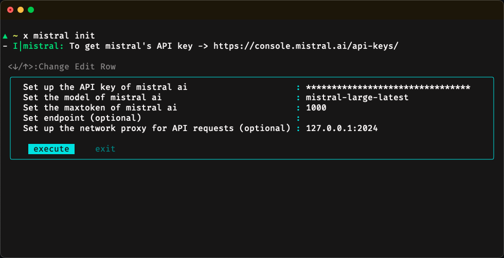
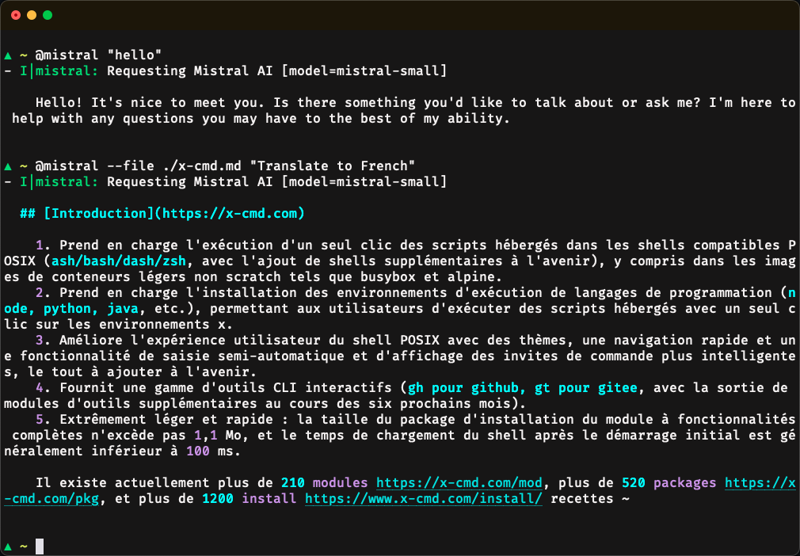
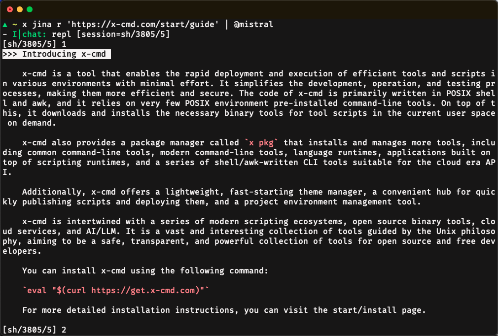

## The Mistral AI Command Line Client

The **mistral module** is a command-line client tool built by the x-cmd team using the Mistral AI API.  Written in posix shell and awk, it uses `curl` to send API requests. 

## Getting started

### Installing x-cmd

- x-cmd is compatible with **Windows**, **Linux**, and **macOS**, making installation easy and straightforward
    ```sh
    eval "$(curl https://get.x-cmd.com)"
    # or
    eval "$(wget -O- https://get.x-cmd.com)"
    ```
- For more installation methods and instructions, please refer to the [official documentation](https://www.x-cmd.com/start/).

### Configuring `x mistral`

Obtaining a **Mistral AI API Key**: https://console.mistral.ai/api-keys/ 

```sh
x mistral init
# or
x mistral --cfg apikey=<Mistral AI API Key>
x mistral --cfg model=<Mistral Model>
```


### Use Mistral AI

- `x mistral` allows you to **send messages or files to Mistral AI**. And to make things easier for users, x-cmd also provides the `@mistral` command as an alias for the `x mistral` command. 

    ```sh
    x mistral chat request "hello"
    @mistral "hello"
    @mistral --file <file_path> "Translate to French"
    ```
    


- `x mistral` can help analyze command results and supports **opening a dialogue in interactive mode**.
    
    ```sh
    x jina r "https://www.x-cmd.com/start/guide" | @mistral
    ```
    **[`x jina r`](https://www.x-cmd.com/mod/jina):** Uses **Jina.ai** to extract content from web pages.

    

## Command Line Options

We offer the `x mistral` and `@mistral` commands, where `x mistral` focuses on model configuration and download management, while `@mistral` emphasizes model applications. Their command-line options are as follows: 

1. `x mistral`:
    ```sh
    SUBCOMMANDS:
        init    Initialize the configuration using interactive mode
        --cur   current session default value management
        --cfg   Manage config item like apikey, etc
        chat    chat with mistral
        model   Model viewing and management
    ```
2. `@mistral`:
    ```sh
    -t,--temperature     Control the diversity of model generated results, the range is [0 ~ 1], when the temperat
    -e                   Send the variable value as context to AI
    -f,--file            Send file content as context to AI
    -n,--history         Specify the number of history as context
    -p                   Specify to get pipe content
    -P,--nopipe          Specify not to get pipe content
    -c                   Confirm before sending the request content to AI
    --jina               Through jina reader, send the webpage content as context to AI
    --ddgo               Send ddgo search content as context to AI
    --tldr               Send tldr content as context to AI
    --eval               Send the execution command results as context to AI
    --kv                 Send key-value pairs as context to AI
    --session            Specify session value
    --minion             Specify minion file
    --model              Specify AI model
    --edit               Edit the request content in the terminal
    --numbered           List the data with line numbers and send it
    --question           Request content
    ```
